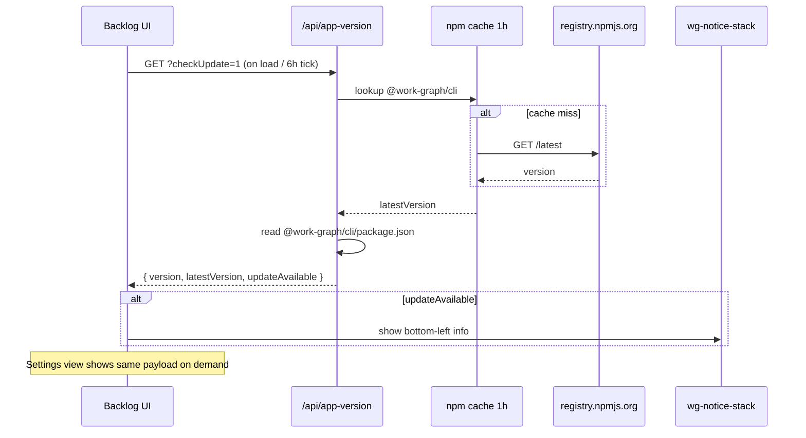

# Analysis: механизм обновлений Work Graph — версия, npm, настройки, уведомления

**Type:** explanation + decision prep (Diátaxis)  
**Date:** 2026-06-04  
**Связи:** [plan-work-graph-ui-settings-v1](../plan-work-graph-ui-settings-v1.md), [ADR npm-first](../adr-work-graph-npm-first-distribution.md), work item `implement-app-version-check-update`, [AN-55](../../work/analytics/work-graph-ui-i18n-best-practices.md)

## Вопрос

Нужен полноценный механизм обновлений:

1. где хранить и откуда читать **текущую версию**;
2. может ли **npm registry** быть источником «последней версии»;
3. как **подключить** уже существующий блок в «Настройках»;
4. как добавить **проактивные уведомления** — информационное окно в левом нижнем углу.

---

## Краткий ответ

| Аспект | Сейчас | Нужно доработать |
|--------|--------|------------------|
| Источник текущей версии | `package.json` **проекта пользователя** (`cwd`) | Читать `@work-graph/cli/package.json` из install root |
| Проверка на npm | Реализована (`registry.npmjs.org/.../latest`) | Кэш 1h, semver-сравнение, фоновая проверка при старте |
| Блок «О приложении» в настройках | HTML + JS + API **есть**, работает при ручном клике | Исправить источник версии; автопроверка; e2e |
| Toast / info-окно слева снизу | **Нет** | Новый UI-компонент + wiring к результату проверки |
| Auto-install из UI | Намеренно **нет** (ADR npm-first v1) | Только подсказка команды `npm i -g` / `npm update` |

Эпик `epic-work-graph-ui-settings-v1` закрыт как «delivered», но для npm-first сценария и проактивных уведомлений нужен **второй проход** (см. §7).

---

## 1. Текущая архитектура (что уже есть)

### 1.1 Backend — `src/appVersionApi.mjs`

```text
readLocalAppVersion(cwd)
  → читает {cwd}/package.json
  → version, packageName, npmPackage (@work-graph/cli)

fetchNpmLatestVersion(packageName)
  → GET https://registry.npmjs.org/{package}/latest
  → payload.version

buildAppVersionResponse({ checkUpdate: true })
  → local + latestVersion + updateAvailable + installCommand
```

Контракт ответа: `workgraph.app-version.v1`.

HTTP endpoint в UI-сервере:

```text
GET /api/app-version
GET /api/app-version?checkUpdate=1
```

Реализация: `src/workGraphBacklogUiServer.mjs` (~строка 10498).

### 1.2 Frontend — секция «О приложении»

В `#settings-view` уже разметка:

- `#settings-version-value` — текущая версия;
- `#settings-check-update` — кнопка «Проверить обновления»;
- `#settings-update-status` — статус проверки;
- `#settings-install-command` — copyable команда установки.

Клиентский код:

- `loadSettingsVersionInfo(checkUpdate)` → fetch `/api/app-version`;
- `renderSettingsPanel()` — вызывается при переходе на view `settings`;
- click handler на кнопке → `renderSettingsPanel({ checkUpdate: true })`.

i18n ключи: `settings.about.*` в `locales/en/ui.json`, `locales/ru/ui.json`.

### 1.3 Тесты

- `tests/appVersionApi.test.mjs` — unit-тесты API с mock fetch;
- `tests/workGraphBacklogUiServer.test.mjs` — smoke HTML (settings view, locale);
- **нет** e2e на клик «Проверить обновления» и **нет** теста корректного источника версии для npm install.

---

## 2. Где хранить текущую версию

### 2.1 Канон npm-first (ADR)

Версия Work Graph для оператора — это версия **опубликованного пакета**, не версия репозитория пользователя:

| Контекст | Правильный источник | Поле |
|----------|---------------------|------|
| npm install в проекте | `node_modules/@work-graph/cli/package.json` | `"version": "0.2.9"` |
| contributor / monorepo dev | `packages/work-graph-cli/package.json` | `"version": "0.2.9"` |
| vendor bundle в CLI | `packages/work-graph-cli/vendor/...` — **без** своего package.json | версия = родительский CLI pkg |

Сейчас в `devDependencies` проекта пользователя pin: `@work-graph/cli`, `@work-graph/mcp` — см. release notes и `init`.

### 2.2 Проблема текущей реализации

`buildAppVersionResponse({ cwd })` передаёт `cwd = requestCtx.repoRoot` — **корень проекта пользователя**.

`readLocalAppVersion` читает `{repoRoot}/package.json`:

- в monorepo WG корневой `package.json` **не имеет** поля `version` → fallback `0.0.0`;
- в типичном проекте пользователя `version` — это версия **их приложения** (например `1.4.2`), а не WG.

**Вывод:** UI показывает неверную версию в npm-first сценарии. Это главный баг, который нужно исправить до «подключения» блока настроек в production sense.

### 2.3 Рекомендуемый резолвер версии

Использовать уже существующий `resolveEngineRoot` / `resolveInstallLayout`:

```text
installRoot = resolveEngineRoot({ projectRoot: cwd, cliModuleUrl: import.meta.url })
versionFile = join(installRoot, 'package.json')   // @work-graph/cli root
```

Fallback chain:

1. `installRoot/package.json` (`@work-graph/cli`);
2. если monorepo dev — `packages/work-graph-cli/package.json`;
3. env `WORKGRAPH_ENGINE_ROOT` → тот же путь;
4. last resort — `0.0.0-dev` + warning в лог.

Дополнительно в ответ API:

```json
{
  "schema": "workgraph.app-version.v1",
  "version": "0.2.9",
  "npmPackage": "@work-graph/cli",
  "installRoot": "...",
  "source": "npm-cli-package"
}
```

---

## 3. Может ли npm registry проверять обновления

**Да.** Это стандартный и уже реализованный подход.

### 3.1 API npm

```http
GET https://registry.npmjs.org/@work-graph/cli/latest
Accept: application/json
→ { "version": "0.2.9", ... }
```

Альтернативы (не нужны в v1):

- `npm view @work-graph/cli version` — CLI-only, не для браузера;
- GitHub Releases API — дублирует npm, лишняя связность;
- собственный endpoint на workgraph.ru — только если npm недоступен (корп. прокси).

### 3.2 Сравнение версий

Сейчас: строковое равенство `latestVersion !== local.version`.

Рекомендация: **semver** (`semver.gt(latest, local)`) — корректно для pre-release и patch.

### 3.3 Кэш (запланирован, не реализован)

В work item `implement-app-version-check-update` указано: *«server npm view (cache 1h)»*.

Сейчас каждый `?checkUpdate=1` бьёт в registry. Нужен in-memory cache в UI server:

```text
key: npmPackage
ttl: 3600_000 ms
value: { latestVersion, fetchedAt }
```

При ошибке сети — отдавать stale cache + `checkError: null`, `fromCache: true`.

### 3.4 Ограничения npm-first v1 (намеренные)

Из ADR и work item:

- **не** auto-install / auto-update из UI;
- оператор получает команду: `npm i -g @work-graph/cli@latest` (global) или `npm update @work-graph/cli @work-graph/mcp` (per-project);
- UI только **информирует**, обновление — в терминале.

---

## 4. Состояние блока «Настройки → О приложении»

### 4.1 Что уже подключено

| Слой | Статус |
|------|--------|
| Sidebar → «Настройки» | ✅ |
| `#settings-view` shell | ✅ |
| Секция «О приложении» (HTML) | ✅ |
| GET `/api/app-version` | ✅ |
| Загрузка версии при открытии settings | ✅ `renderSettingsPanel()` |
| Кнопка «Проверить обновления» | ✅ |
| i18n EN/RU | ✅ |

### 4.2 Что не подключено / сломано

| Проблема | Влияние |
|----------|---------|
| Неверный `package.json` для version | Оператор видит версию своего проекта или `0.0.0` |
| Нет фоновой проверки при старте UI | Обновление видно только после ручного захода в Settings |
| Нет кэша npm | Лишние запросы, медленнее при частых проверках |
| Нет toast-уведомления | Оператор не узнаёт об update, пока не откроет настройки |
| Нет e2e / API integration test на npm-first cwd | Регрессия не ловится |

**Итог формулировки «нужно подключить»:** UI-оболочка подключена, но **data path** (версия + проактивное оповещение) — нет.

---

## 5. Механизм уведомлений — info-окно слева снизу

### 5.1 Текущее состояние

В backlog UI **нет** toast/snackbar/notification stack. Близкие паттерны:

- `detail-remote-update-banner` — inline banner в drawer при remote revision (не toast);
- Inbox events (`/api/inbox-events`) — sidebar badge на Home (mission control), не для версий;
- `window.alert` — только для ошибки смены locale.

UX-документ (`work/analytics/ux-current-state-and-vector.md`) упоминает Browser Notification API для критичных событий — **не реализовано**.

### 5.2 Предлагаемый компонент — `wg-notice-stack`

Расположение: **fixed, bottom-left** (как запросил оператор), поверх контента, не перекрывает agent-run-dock справа.

```text
┌─────────────────────────────────────────────┐
│  [sidebar]  │  main content    │ [dock]    │
│             │                  │           │
│             │                  │           │
│  ┌──────────────────┐          │           │
│  │ ℹ Доступно       │          │           │
│  │   обновление     │          │           │
│  │   0.2.9 → 0.3.0  │          │           │
│  │ [Настройки] [✕]  │          │           │
│  └──────────────────┘          │           │
└─────────────────────────────────────────────┘
```

Поведение:

| Свойство | Значение |
|----------|----------|
| Триггер | `updateAvailable === true` после фоновой проверки |
| Повтор | Не чаще 1 раза на версию (localStorage `wg_dismissed_update_notice`) |
| Действия | «Открыть настройки» → switch view settings; «Закрыть» → dismiss |
| Auto-hide | Опционально 30s для info, не для update-available |
| a11y | `role="status"`, `aria-live="polite"`, focus trap не нужен |
| i18n | `notice.updateAvailable.title`, `.body`, `.openSettings`, `.dismiss` |

CSS: переиспользовать design tokens (`--panel`, `--border`, `--shadow-card`, `--accent`); z-index выше main, ниже modal/drawer overlay.

### 5.3 Когда проверять (live sync scope)

Добавить scope в `createLiveSyncCoordinator` (уже есть home 30s, agent-dock 5s):

```javascript
liveSync.registerScope('app-version', {
  intervalMs: 6 * 60 * 60 * 1000,  // 6h, или 1h если оператор online
  enabled: () => true,
  onTick: () => checkAppVersionAndMaybeNotify(),
});
```

Плюс **один immediate check** ~5s после load (не блокирует first paint).

Flow:

```text
UI load
  → GET /api/app-version?checkUpdate=1  (cached on server)
  → if updateAvailable && !dismissed(latestVersion)
       → pushNotice({ kind: 'update-available', ... })
  → Settings view still shows full detail + install command
```

### 5.4 Альтернатива — расширить Inbox

Можно писать событие `kind: app-update-available` в inbox stream. Минусы для v1:

- Inbox привязан к Home tab, не глобален;
- оператор может не открыть Home;
- toast слева снизу — явнее для update UX.

Рекомендация: **отдельный notice stack** для v1; inbox — phase 2 для audit trail.

---

## 6. Схема потока данных (целевая)



---

## 7. План работ (предложение)

| # | work.id (новый или extend) | P | Суть |
|---|---------------------------|---|------|
| 1 | `fix-app-version-read-from-cli-package` | P0 | `readLocalAppVersion` → install root, не repoRoot |
| 2 | `implement-app-version-npm-cache` | P1 | In-memory cache 1h в server |
| 3 | `wire-app-version-background-check` | P1 | liveSync scope + check on load |
| 4 | `implement-wg-notice-stack-bottom-left` | P1 | Toast UI + dismiss persistence |
| 5 | `wire-update-notice-from-app-version` | P1 | Связать notice ↔ API response |
| 6 | `test-app-version-npm-first-integration` | P1 | Test с temp project + fake registry |
| 7 | `e2e-settings-update-check-smoke` | P2 | Playwright: settings shows CLI version |

Зависимости: (1) блокирует осмысленную работу (2–5).

---

## 8. Контракт API v1.1 (опциональное расширение)

Обратно совместимо с текущим `workgraph.app-version.v1`:

```json
{
  "schema": "workgraph.app-version.v1",
  "version": "0.2.9",
  "npmPackage": "@work-graph/cli",
  "packageName": "@work-graph/cli",
  "latestVersion": "0.3.0",
  "updateAvailable": true,
  "installCommand": "npm update @work-graph/cli @work-graph/mcp",
  "installCommandGlobal": "npm i -g @work-graph/cli@latest",
  "checkError": null,
  "checkedAt": "2026-06-04T12:00:00.000Z",
  "fromCache": false,
  "source": "npm-cli-package"
}
```

`installCommand` для per-project npm-first предпочтительнее global `-g`.

---

## 9. Риски и границы

| Риск | Митигация |
|------|-----------|
| Корп. прокси блокирует registry.npmjs.org | Graceful `checkError`, stale cache, текст «проверьте вручную» |
| False positive при локальном dev (`0.0.0-dev`) | Не показывать notice если `version` ends with `-dev` |
| Два пакета (@work-graph/cli + @work-graph/mcp) | v1 — только CLI version; v2 — composite doctor |
| Оператор dismiss и забывает | Re-show при `latestVersion` bump (новый dismiss key) |

---

## 10. Вывод

1. **Механизм обновлений наполовину готов:** API, endpoint, settings UI и ручная проверка есть.
2. **Критический gap:** текущая версия читается из `package.json` проекта, а должна — из `@work-graph/cli`.
3. **npm registry — правильный и уже используемый источник** «последней версии»; нужны кэш и semver.
4. **Блок настроек подключён на уровне UI**, но без корректных данных и без проактивного UX.
5. **Уведомление слева снизу — новый компонент** `wg-notice-stack`, связанный с фоновой проверкой `/api/app-version?checkUpdate=1`.

Следующий шаг: завести work items из §7 и начать с `fix-app-version-read-from-cli-package` (P0).
