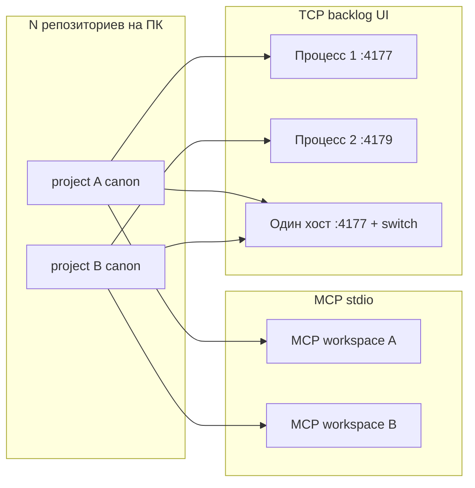

# Analysis: несколько проектов WG на одном ПК — порты и параллельная работа

**Type:** explanation (Diátaxis) — уточнение к [AN-40](../../work/analytics/work-graph-project-deployment-model.md)  
**Date:** 2026-06-04  
**Outcome:** ответ на вопрос «все проекты на одном порту?» при **текущем** npm-first per-project UX

## Вопрос

На одном компьютере установлено несколько репозиториев с Work Graph (`npx @work-graph/cli init .` в каждом). Будут ли они **все работать одновременно на одном порту** (по умолчанию `4177`)?

## Краткий ответ

| Слой | Несколько проектов параллельно? | Один порт `4177`? |
|------|--------------------------------|-------------------|
| **Канон** (`intent/`, `.work-graph/config.json`) | Да — у каждого репо свой | Не применимо |
| **MCP** (агент в IDE) | Да — по одному корню на workspace / окно Cursor | Не TCP-порт (stdio) |
| **Backlog UI** (`npm run workgraph:ui`) | **Нет** для двух процессов на одном порту | **Да, конфликт:** второй `listen(4177)` → `EADDRINUSE` |
| **Один UI + переключение проектов** (power-user) | Да — через реестр и `POST /api/workspace/switch` | **Да, один процесс** — один порт, один *активный* корень за раз |
| **Публичный маркетинговый сайт** | Отдельный продукт | **4178** (`public-site:serve`), не backlog |

**Итог:** «несколько проектов» ≠ «несколько UI на `:4177` одновременно». Канон и MCP масштабируются по репозиториям; **HTTP UI по умолчанию — один слушатель на порт**, если не задать разные порты или не использовать один хост с переключателем.

## Как устроено сейчас (после AN-40 и pivot per-project)

### 1. Основной UX — установка в проект

Принято в [ADR per-project install](../adr-work-graph-per-project-install.md) и [npm-first](../adr-work-graph-npm-first-distribution.md):

- каждый репозиторий хранит свой канон и `.work-graph/config.json` (schema v2, `uiPort` по умолчанию **4177**);
- `npm run workgraph:ui` поднимает сервер **для этого** `projectRoot` (`WG_PROJECT_ROOT` выставляется в `.work-graph/run-ui.mjs`);
- пакеты `@work-graph/cli` / `@work-graph/mcp` — в `node_modules` проекта, движок не копируется в git.

Это **вариант A** из AN-40 для оператора «один Cursor — один репо»: просто и предсказуемо, но при **двух одновременных** `workgraph:ui` без смены порта — коллизия.

### 2. Power-user — гибрид C (реализован, не в onboarding)

Эпик `epic-work-graph-multiproject-host` закрыт ([closing](../../work/analytics/closing-epic-work-graph-multiproject-host.md)):

- реестр `~/.work-graph/workspaces.json`;
- API `GET /api/workspaces`, `POST /api/workspace/switch`, `POST /api/workspace/register`;
- один процесс backlog UI может обслуживать **несколько корней**, меняя активный `repoRoot` **без перезапуска**;
- переключатель в sidebar **снят** — переключение через CLI/API, не как первый шаг в runbook.

Анти-цель из [ADR multiproject host](../adr-work-graph-multiproject-host.md): *«Не держать N процессов на порту 4177»* — относится к **целевому** режиму хоста, не к тому, что per-project init «магически» шарит порт между N репо.

### 3. Откуда берётся порт

```text
WORKGRAPH_BACKLOG_UI_PORT  →  .work-graph/config.json uiPort  →  4177
```

См. `src/workGraphProjectInit.mjs` (`buildProjectConfig`, `buildRunUiScriptContent`) и `src/workGraphBacklogUiServer.mjs` (`DEFAULT_PORT = 4177`).

Публичный сайт — **отдельно** `WORKGRAPH_PUBLIC_SITE_PORT` / **4178** (`src/publicSiteStandaloneServer.mjs`). Его не путать с backlog UI проекта.

## Сценарии на одном ПК

### Сценарий A — два репо, оба `npm run workgraph:ui` (типичная ошибка ожиданий)

1. Проект **Alpha**: UI слушает `127.0.0.1:4177` — OK.  
2. Проект **Beta**: тот же дефолтный порт — **второй процесс не поднимется** (`EADDRINUSE`), пока Alpha не остановлен.

**Не** «оба проекта на одном порту в браузере» — один порт занят одним процессом.

**Обход:**

- остановить UI в другом проекте; или
- задать другой порт для Beta: `uiPort` в config при `init --port`, или `WORKGRAPH_BACKLOG_UI_PORT=4179 npm run workgraph:ui`; или
- один хост: `work-graph register` + один `ui`, переключение `workspace/switch`.

### Сценарий B — два репо, только MCP (без UI)

В Cursor обычно **один workspace = один корень**. В `.cursor/mcp.json` каждого проекта — `WORKGRAPH_ROOT` на свой каталог, сервер `@work-graph/mcp` через stdio.

- **Два окна / два workspace** с разными репо → два MCP-процесса, **без конфликта портов**.
- Канон читается из своего `intent/` — параллельно и независимо.

### Сценарий C — один UI, несколько проектов (AN-40 вариант C)

1. Зарегистрировать корни: `work-graph register /path/to/alpha`, `register /path/to/beta` (или `--register-host` при init).  
2. Поднять **один** UI (из любого зарегистрированного хоста или с `WG_PROJECT_ROOT`).  
3. Переключать активный проект API/UI — на **одном** `:4177` в каждый момент времени отображается **один** бэклог.

Это «все проекты через один порт», но **не одновременно на экране** — последовательное переключение корня.

## Сводная модель (для промптов агенту и runbook)



- **MCP:** N параллельных (по workspace).  
- **Per-project UI:** N процессов → **N портов** (или один активный).  
- **Host UI:** 1 процесс, 1 порт, N корней в реестре, 1 активный.

## Рекомендации оператору

| Цель | Действие |
|------|----------|
| Обычная работа в одном репо | `npm run workgraph:ui` → `:4177`, один процесс |
| Два репо, два UI сразу | Разные `uiPort` / `WORKGRAPH_BACKLOG_UI_PORT` (4177, 4179, …) |
| Много репо, один браузер | Реестр + один UI + `workspace/switch` (power-user) |
| Только агент | MCP достаточно; UI не обязателен параллельно |

## Связь с AN-40 (что остаётся верным)

AN-40 верно диагностировал: **чистый per-project UI на одном дефолтном порту не масштабируется** на N одновременных вкладок. Решение C (реестр + switch) **в коде есть**, но **основной UX** после pivot — init в каждый репо без обязательного central host ([ADR per-project](../adr-work-graph-per-project-install.md)).

То есть сегодня:

- **по умолчанию** пользователь получает модель «один репо — один UI на 4177»;
- **не по умолчанию** — один хост на 4177 для всех репо с переключением;
- **не автоматически** — N репо на одном 4177 без switch и без второго порта.

## См. также

- [AN-40](../../work/analytics/work-graph-project-deployment-model.md) — исходный разбор моделей A/B/C  
- [Runbook deploy](../runbook-deploy-work-graph-on-project.md) — user-first init  
- [ADR multiproject host](../adr-work-graph-multiproject-host.md) — анти-цель N процессов на 4177  
- [ADR per-project install](../adr-work-graph-per-project-install.md) — приоритет UX  
- [Closing epic multiproject](../../work/analytics/closing-epic-work-graph-multiproject-host.md)
