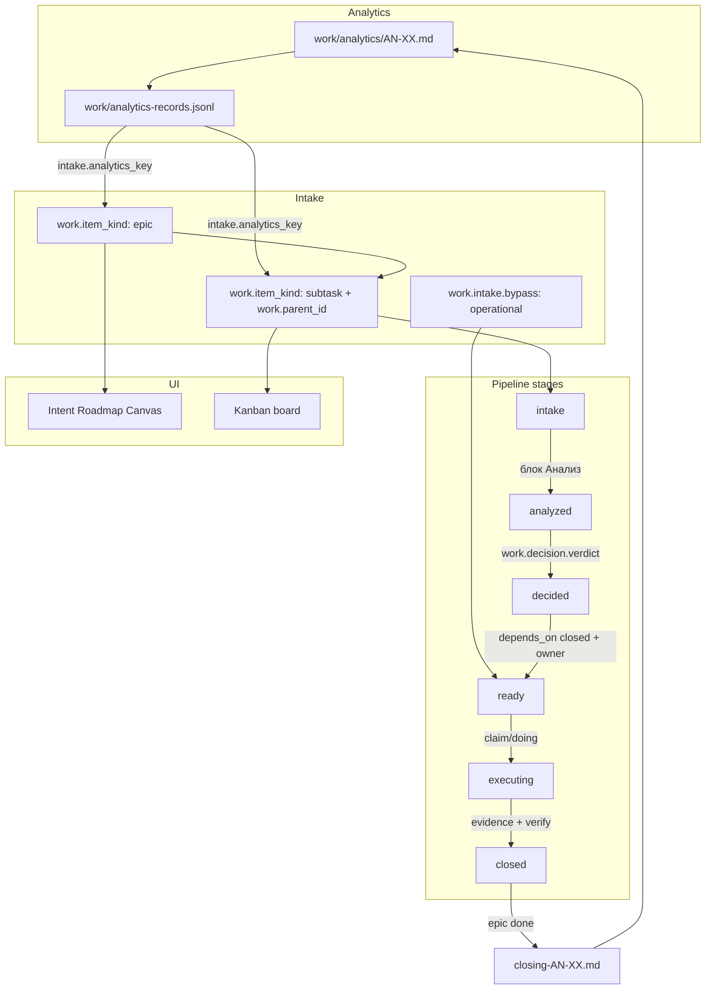

# Канон пайплайна: Анализ → Эпик → Задачи → Беклог → Доска

## Цель

Зафиксировать единый операторский поток Work Graph: от analytics-записи до kanban-доски и обратного closing-анализа. Код уже реализует большую часть; этот документ — **источник правды для людей и lint**.

**Протокол:** [`protocols/decision-pipeline-canon-v1.bvc`](../protocols/decision-pipeline-canon-v1.bvc)  
**Код:** [`src/workItemDecisionPipeline.mjs`](../src/workItemDecisionPipeline.mjs), [`src/workItemHierarchy.mjs`](../src/workItemHierarchy.mjs), [`src/backlogSchemaLint.mjs`](../src/backlogSchemaLint.mjs)  
**Анализ:** [AN-22](../work/analytics/pipeline-analysis-to-board.md)

## Полная схема



## Стадии pipeline

| `work.pipeline_stage` | Когда | Обязательные поля |
|---|---|---|
| `intake` | задача создана, разбор не начат | `work.id`, `work.status`, `migration.strategy` |
| `analyzed` | заполнен блок **Анализ:** (6 разделов) | + непустой `Анализ:` |
| `decided` | есть вердикт | + `work.decision.verdict` ∈ {useful, harmful, defer} |
| `ready` | можно брать в работу | + `work.owner_role`, закрытые `work.depends_on` |
| `executing` | claim / doing / verify | kanban active |
| `closed` | done / blocked | + `Свидетельства:` или evidence timeline |

Вывод стадии: `inferPipelineStage()` в [`workItemDecisionPipeline.mjs`](../src/workItemDecisionPipeline.mjs).

## Эпик и подзадачи

| Метка | Значение | Где читается |
|---|---|---|
| `work.item_kind` | `epic` \| `task` \| `subtask` | `readWorkItemKind()` |
| `work.parent_id` | id родителя (один) | `readWorkItemParentId()` |
| `work.depends_on` | порядок исполнения | `parseWorkItems`, promote gate |

**Правило:** `depends_on` ≠ parent. Подзадачи одного эпика не блокируют друг друга только потому, что они «внутри эпика».

Подробнее: [`protocols/work-item-hierarchy-v1.bvc`](../protocols/work-item-hierarchy-v1.bvc).

## Связь с analytics (N:M)

| Направление | Метка | Пример |
|---|---|---|
| Work ← Analytics | `intake.analytics_key` | `AN-22` |
| Work ← Analytics (несколько) | `intake.analytics_keys` | `AN-20, AN-22` |
| Analytics → Epic | `analytics.feeds_epics` | `[epic-decision-pipeline-canonization]` |

Один AN может порождать несколько эпиков; один эпик может ссылаться на несколько AN.

## Operational bypass и charter-выход

| Класс работ | Путь | Метки |
|---|---|---|
| **Эпик / инициатива** | AN → epic → subtasks → board | `work.item_kind: epic`, `intake.analytics_key` |
| **Operational** | прямо в backlog → ready | `work.intake.bypass: operational`, `operational.reason: …` |
| **Charter / правило** | AN → правка charter/ADR | в AN: «вывод: charter», ссылка на файл |

### No fake-epic checklist

Создавай эпик только если:

1. Есть **общая задумка** (basis/goal родителя на 2+ подзадачи).
2. Подзадачи **не независимы** operationally (иначе — отдельные задачи без parent).
3. Закрытие эпика имеет смысл как **единый результат** (closing-анализ).

### Примеры

**Operational** (без эпика):

```text
work.id: hotfix-lint-warning
work.intake.bypass: operational
operational.reason: однострочный lint fix без изменения архитуры
work.status: ready
```

**AN → Charter** (без work item):

```text
AN-XX вывод: charter
Изменён: charter/main.bvc §Слои_Ядра — добавлена ссылка на decision-pipeline-canon
```

**Эпик** (полный путь):

```text
work.id: epic-decision-pipeline-canonization
work.item_kind: epic
intake.analytics_key: AN-22
```

## Agent intake vs execute

Разделение **приёма** (analysis-only) и **исполнения** (epic/code). Источник: [AN-25](../work/analytics/agent-bypass-work-graph-dual-backlog.md) R5.

| Ситуация | Допустимый артеfact | Chat TodoWrite? |
|---|---|---|
| Разбор, «что дальше?», «проведи анализ» | `work/analytics/AN-XX.md` + jsonl | ❌ |
| Согласованная инициатива («создавай задачи / делай») | epic + subtasks в `intent/**/work` | ❌ |
| Мелкий hotfix | `work.intake.bypass: operational` | ❌ |
| Исполнение subtask | claim → code → evidence → done | ⚠️ только micro-steps внутри claimed `work.id` |
| История решений | `docs/plan-*.md` (строки с `` `work.id` ``) | ❌ |
| Ephemeral в одном turn («прочитать 5 файлов») | — | ✅ |

**Правила для Cursor IDE-агента:**

1. На аналитический вопрос **не** запускать `seed:*` и **не** создавать эпик без явной команды оператора.
2. Seed scripts: default `work.status: backlog`, не `doing`.
3. Единый trackable backlog — `intent/**/work/*.work.bvc`; см. `.cursor/rules/agent-workgraph-single-backlog.mdc` и `rules/agent-behavior/cursor-ide-workgraph-parity.bvc`.

Lint plan↔work: `npm run lint:plan-work-alignment`.

## Chat read-only scope

Принцип **«чат read, kanban write»** (AN-28): информативность в сессии агента — через **read-only проекцию** из Work Graph, без двусторонней синхронизации Cursor TodoWrite ↔ `work.status`.

**Источник:** [AN-28](../work/analytics/chat-work-graph-todo-sync.md) · MCP `get_epic_work_scope` · rule `chat-work-scope-readonly` · `GET /api/epic-scope?epicId=…`

### Поверхности: read / write

| Поверхность | Read (из WG) | Write (в WG) | TodoWrite |
|---|---|---|---|
| **Kanban / atoms / MCP** | snapshot, list_work_items | claim, complete, evidence, status | ❌ |
| **Home / Agent Run dock** | My queue, active runs, inbox | — | ❌ |
| **Markdown «Scope (read-only)» в ответе агента** | `get_epic_work_scope` при execute эпика | — | ❌ |
| **Cursor chat TodoWrite (список subtasks эпика)** | — | — | ❌ **запрещено** (>3 пунктов с `work.id`) |
| **Ephemeral micro-steps (1–3, без work.id)** | — | — | ✅ один turn, внутри claimed `work.id` |

### Запрещено

- ❌ Двусторонняя sync: отметка todo в чате **не** меняет `work.status`.
- ❌ Списки T1/T2/… без `work.id` как trackable backlog.
- ❌ TodoWrite как замена `Свидетельства:` / evidence timeline.

### Допустимо

- ✅ Один блок в начале execute-фазы эпика:

```markdown
## Scope (read-only, Work Graph)
- [x] `mcp-epic-rollup-scope-resource` — done
- [~] `agent-behavior-chat-scope-block` — doing
- [ ] `document-chat-scope-readonly-canon` — backlog
```

  Чеклист: `[x]` done/verified · `[~]` doing/in_progress/claimed/verify · `[ ]` backlog/ready/blocked.  
  Генерация: `formatEpicScopeMarkdown()` в [`src/epicWorkScope.mjs`](../src/epicWorkScope.mjs).

- ✅ Live UI poll (P2): Agent dock / sidebar scope panel — [`ui-agent-scope-panel-poll`](../intent/ui/dashboard/work/ui-agent-scope-panel-poll.work.bvc).

### Связь с Agent intake vs execute

| Ситуация | Scope block | TodoWrite |
|---|---|---|
| Intake / «что дальше?» | ❌ | ❌ |
| Execute эпика или claimed epic work | ✅ один раз в начале фазы | ❌ для subtask list |
| Execute одной subtask | опционально rollup parent epic | ⚠️ micro-steps only |

## Closing loop

Когда эпик переходит в `done` / `verified`:

1. Предложить оператору `work/analytics/closing-<epic-slug>.md`.
2. В новой AN-записи указать `analytics.feeds_epics: [<slug>]`.
3. Уроки из closing могут породить новые эпики или charter-правки.

Реализация: задача `implement-closing-analysis-after-epic-done` (T2 эпика AN-22).

## DoR / DoD (lint)

| Переход | Проверка | Severity |
|---|---|---|
| → analyzed | непустой блок `Анализ:` | warning |
| → decided | `work.decision.verdict` задан | error если stage=decided |
| → ready | `work.owner_role` задан | warning |
| → ready | все `depends_on` closed | error |
| → closed | evidence не пустой | warning (уже есть) |
| epic closed | closing-AN существует | warning (T2) |
| intake | `intake.analytics_key` или bypass | warning |

Lint: `lintPipelineStageIssues()` в [`backlogSchemaLint.mjs`](../src/backlogSchemaLint.mjs).

## Связанные протоколы

| Протокол | Роль |
|---|---|
| [`work-item-decision-pipeline-v1.bvc`](../protocols/work-item-decision-pipeline-v1.bvc) | analyze → decide → promote |
| [`work-item-hierarchy-v1.bvc`](../protocols/work-item-hierarchy-v1.bvc) | parent_id, item_kind |
| [`backlog-schema-lint-v1.bvc`](../protocols/backlog-schema-lint-v1.bvc) | общий lint backlog |
| [`plan-workgraph-intent-to-verified-flow.md`](plan-workgraph-intent-to-verified-flow.md) | операторский UX flow |

## Todo

- [x] Protocol `decision-pipeline-canon-v1.bvc`
- [x] Docs страница с mermaid и таблицами
- [x] DoR/DoD lint rules (T3)
- [x] Closing-analysis hook при epic done — `buildClosingAnalysisSuggestion` в apply atom inspector (T2 MVP; UI banner — follow-up)
- [ ] Epic rollup в Intent Roadmap Canvas (T5)
