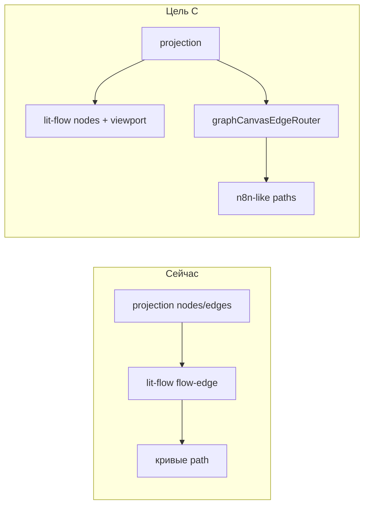

# План: рёбра графа как в n8n

## Цель

Сделать стрелки на **Граф намерений**, **Карта архитектуры** и **Схема** читаемыми и предсказуемыми — как в n8n (Vue Flow + dagre): одна линия на ребро, корректные порты top/bottom/left/right, плавные bend без «рассыпанных» параллельных линий.

## Почему предыдущие правки не помогли

Прошлые итерации били в **layout и карточки**, а не в **генерацию path рёбер**:

| Что меняли | Эффект | Почему стрелки остались кривыми |
|------------|--------|----------------------------------|
| dagre spacing, `N8N_INSPIRED_DAGRE_LR` | узлы реже наезжают | path рёбер lit-flow не зависит от dagre |
| `layoutIntentRoadmapWorkStack` | колонка задач справа | вертикальные ребра идут через `smoothstep` |
| realistic card height, overlap resolver | меньше пересечений box'ов | SVG path считается отдельно |
| смена `default` / `smoothstep`, кастомные handles | задумка верная | **lit-flow игнорирует направление handle** |

### Корневая причина (lit-flow)

В `lit-flow` → `flow-edge.js` при найденном handle `source-bottom` / `target-top` координаты берутся правильно, но **Position всегда подставляется как Right / Left**:

```javascript
// flow-edge.js (упрощённо)
getSourcePosition() {
  if (handlePos) return { ...handlePos, position: Position.Right }; // ← баг для bottom
}
getTargetPosition() {
  if (handlePos) return { ...handlePos, position: Position.Left };  // ← баг для top
}
```

`getSmoothStepPath` из `@xyflow/system` строит **сначала горизонтальный сегмент**, если position = Right/Left. Для вертикальной колонки задач (dx ≈ 0, dy > 0) получается L-образный «ломаный» path — на скрине это выглядит как пучок параллельных серых линий.

### Вторая причина (наш адаптер)

До lit-flow уже был рабочий роутер **`intentRoadmapEdgeGeometry`** (`src/intentRoadmapCanvas.mjs`):

- horizontal LR: bezier через середину (как n8n workflow edge);
- vertical stack: cubic от bottom → top с bend 28–72px;
- учитывает `layoutDirection`, rejected, anchor по центру карточки.

При миграции на lit-flow geometry **продолжает считаться** в canvas model, но **`graphCanvasProjectionToFlow.mjs` её не передаёт** — рёбра рисует только lit-flow.

### Что делает n8n (референс)

```
Workflow JSON → dagre layout → nodes[] + edges[]
       ↓
@vue-flow/core (viewport, pan/zoom)
       ↓
@vue-flow/system: getBezierPath / getSmoothStepPath + корректные Handle.position
       ↓
CanvasEdge + DOM Card nodes
```

Ключевое: **Position handle совпадает с физическим портом** (Top/Bottom/Left/Right). Layout и edge router — разные слои, но согласованы.

---

## Варианты решения

### A. Быстрый workaround в адаптере (1–2 часа)

**Суть:** не использовать `smoothstep` + кастомные handles для вертикали.

| Направление | type | handles |
|-------------|------|---------|
| dx > 35% width, LR | `default` (bezier) | source / target (бок) |
| dy > 12, dx маленький | `straight` | source-bottom / target-top |

**Плюсы:** минимальный diff, сразу убирает «ломаные» L-path.  
**Минусы:** вертикаль без скругления n8n; не чинит architecture/schematic fan-in; не использует уже написанную geometry.  
**Риск:** низкий.

---

### B. Починить lit-flow локально (0.5–1 день)

**Суть:** патч `flow-edge.js` — маппинг `sourceHandle`/`targetHandle` → `Position.Bottom/Top/Left/Right`; опционально PR upstream.

**Плюсы:** один fix для всех графов на lit-flow; smoothstep начнёт работать.  
**Минусы:** форк/patch `node_modules` или vendoring; обновления lit-flow ломают патч; **edgeTypes/custom edges в lit-flow всё ещё нет**.  
**Риск:** средний (поддержка).

---

### C. Гибрид: lit-flow nodes + свой SVG edge layer (рекомендуется, 2–4 дня)

**Суть:** как задумывалось в AN-4 Phase A до полного lit-flow:

```
projection (x,y,width,height)
    ├─ lit-flow: только карточки + pan/zoom + minimap
    └─ SVG overlay: graphCanvasEdgeRouter.mjs
           ↑ intentRoadmapEdgeGeometry + architecture lanes
           sync transform с viewport lit-flow
```

1. Вынести `intentRoadmapEdgeGeometry` + architecture edge lanes в **`graphCanvasEdgeRouter.mjs`**.
2. В `mountGraphCanvasLitFlow.ts` — слой `<svg class="graph-canvas-edges">` поверх viewport (или внутри shell), `pointer-events: none` на path, labels как сейчас.
3. Отключить `<flow-edge>` для product views (или скрыть `flow-edges-layer`).
4. Подписка на `canvas.instance.subscribe` → пересчёт transform + paths.
5. Vitest: snapshot path `d` для fixture intent roadmap (vertical + horizontal + rejected).

**Плюсы:** максимально близко к n8n; переиспользуем **уже протестированную** geometry; не зависим от багов lit-flow edges.  
**Минусы:** два слоя рендера; нужна синхронизация viewport.  
**Риск:** низкий–средний (контролируемый код).

---

### D. Полный layout через dagre без work-stack колонки (1–2 дня)

**Суть:** один dagre LR/TB граф на все узлы (intent + tasks), без `layoutIntentRoadmapWorkStack`.

**Плюсы:** больше рёбер horizontal → меньше vertical smoothstep.  
**Минусы:** теряется UX «колонка задач справа от решения»; dagre может снова дать overlap на option fan-out; **не заменяет edge router**.  
**Риск:** регрессия UX.

---

### E. Смена runtime: Vue Flow / React Flow island (1–2 недели)

**Суть:** отдельный bundle с `@xyflow/react` или `@vue-flow/core`, mount только в graph views.

**Плюсы:** parity с n8n «из коробки».  
**Минусы:** против ограничения «vanilla SSR UI»; второй фреймворк; дублирование card components.  
**Риск:** высокий, out of scope unless explicit ask.

---

## Рекомендация

| Приоритет | Вариант | Зачем |
|-----------|---------|-------|
| **1 (сейчас)** | **C — гибрид SVG edges** | единственный путь к n8n-quality без смены стека; geometry уже есть |
| **2 (опционально параллельно)** | **A — straight vertical** | 1 PR как временный hotfix, если нужен результат до C |
| **3 (не сейчас)** | B, D, E | либо техдолг, либо регресс UX, либо overkill |



---

## Todo

- [ ] Зафиксировать repro: fixture `buildIntentRoadmapCanvasModel` → screenshot/assert path для edge `epic-1 → sub-1` (vertical)
- [ ] **A (optional hotfix):** `graphCanvasProjectionToFlow` — vertical → `straight`, убрать smoothstep на колонке задач
- [x] **C1:** создать `graphCanvasEdgeRouter.mjs` — обобщить `intentRoadmapEdgeGeometry` + API `{ fromNode, toNode, layoutDirection, rejected }`
- [x] **C2:** `mountGraphCanvasLitFlow.ts` — SVG edge layer, sync viewport transform, скрыть lit-flow edges
- [x] **C3:** architecture/schematic — подключить lane geometry или тот же router (generic bbox router на projection)
- [x] **C4:** тесты: path quality (no self-intersect vertical), labels на mid-point geometry
- [x] **C5:** automated regression — graphCanvasEdgeRouter + graphCanvasLitFlow + intentRoadmapCanvas tests green (visual n8n compare — operator smoke)
- [x] Документировать в `graph-visualization-engine.md`: «lit-flow = nodes/viewport only; edges = Work Graph router» (см. `graphCanvasEdgeRouter.mjs` header + epic `implement-graph-canvas-svg-edges-v1` closed 2026-05-31)

---

## Критерий завершения

1. Вертикальная колонка задач: **одна** линия parent → child, bottom → top, без горизонтального «хвоста».
2. LR spine (вопрос → варианты → решение): bezier как в n8n, labels читаемы.
3. Ребро decision → epic (горизонталь + переход в колонку): один path, без дублирования stroke.
4. Vitest на router + существующий layout quality suite зелёный.
5. Не ломаются: pan/zoom, minimap, keyboard nav, full-screen canvas.
