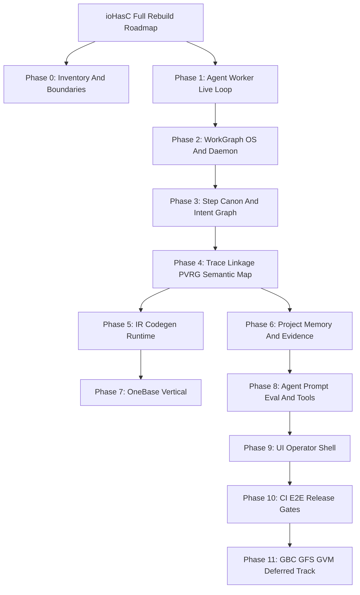

# Полный backlog переноса ioHasC

## Цель

Сформировать полный inventory roadmap переноса ioHasC в Work Graph rebuild: не только ближайший post-MVP, а дерево фаз и задач по всем крупным подсистемам старого проекта.

## Почему

Текущий rebuild MVP доказал узкий контур: `.bvc` canon, Work Graph runtime, operator UI, verification loop и OneBase golden path. Дальше нужно не хаотично переносить старый ioHasC, а разложить весь объём на управляемые WorkItems с явной стратегией:

- `port` — переносим существующий слой почти как есть;
- `rebuild` — пересобираем вокруг Work Graph OS;
- `replace` — заменяем старую реализацию более простой проекцией (см. [adr-workgraph-replace-ide-shell.md](adr-workgraph-replace-ide-shell.md));
- `defer` — фиксируем как R&D/поздний трек.

## Фазы

## Inventory

| Фаза | Слой ioHasC | Стратегия | Что попадает в backlog |
|---|---|---|---|
| 0 | Inventory / boundaries | rebuild | root roadmap, стратегия миграции, map старых подсистем |
| 1 | Agent worker live loop | rebuild | live-loop CLI, Worker Output evidence, transition proposal |
| 2 | WorkGraph OS / daemon | rebuild + port | scheduler tick, recovery, draft intake, audit journal, projections |
| 3 | Step / HasC canon | port + rebuild | intent hierarchy, WorkItem intent links, charter gate, catalog/passport |
| 4 | Trace / PVRG / semantic map | port + rebuild | trace envelope, unified linkage, PVRG task scope, taxonomy routing |
| 5 | IR / codegen / runtime | port | codegen evidence, Bracket IR, compiler round-trip, code-gap feeder |
| 6 | Project Memory / Evidence | rebuild | MemoryRecord writer, structured evidence, dashboard projections |
| 7 | OneBase vertical | port + rebuild | OneBase template, REST evidence, PVRG nodes, MCP parity |
| 8 | Agent runtime / prompt ops | port + rebuild | tool audit, role handoff, prompt eval, Graph RAG, E2E matrix |
| 9 | UI operator shell | port + rebuild | dashboard v2, intent tree UI, semantic map cross-highlight, kanban projection |
| 10 | Tests / CI | port + rebuild | Vitest, daemon integration, E2E tick, backlog lint, optional LLM matrix |
| 11 | GBC / GFS / GVM / Genesis | defer + port | GBC slices, evidence health summary, GFS overlay, optional GVM verify |

## Границы scope

| Контур | Что входит | Что не входит |
|---|---|---|
| **MVP rebuild (закрыт)** | Work Graph runtime, backlog UI, verification loop, OneBase golden path static gate, local worker MVP | Полный daemon, LLM execution, semantic map UI, Bracket IR port |
| **Post-MVP (сейчас)** | Agent worker live-loop, Phase 0 inventory, optional LLM eval design | Полный перенос agent orchestrator, GBC/GVM |
| **Deferred R&D** | GBC/GFS/GVM, Genesis IDE roadmap, Zig runtime experiments | Блокеры для operator dashboard и deterministic CI |

## Migration labels

Machine labels для backlog atoms:

| Label | Значение | Пример |
|---|---|---|
| `migration.strategy` | `port` \| `rebuild` \| `replace` \| `defer` | `migration.strategy: rebuild` |
| `migration.source_repo` | путь или имя исходного репозитория | `migration.source_repo: ../project` |
| `migration.source_paths` | CSV путей в старом ioHasC | `migration.source_paths: src/agent/orchestrator.js, src/iohasc/daemon/` |
| `migration.target_phase` | id фазы rebuild (`phase-0-*` … `phase-11-*`) | `migration.target_phase: phase-8-agent-prompt-eval-tools` |

Правила:

- `port` — переносим с минимальной адаптацией к Work Graph contracts.
- `rebuild` — пересобираем поведение вокруг Work Graph OS; старый код — reference only.
- `replace` — новая проекция проще старой реализации (например derived graph вместо React Flow editor).
- `defer` — видим в backlog, но не блокирует MVP/post-MVP; отличать от `work.status: blocked`.

## Сверка с ioHasC IMPLEMENTATION_STATUS

Источник: `../project/docs/architecture-v2/IMPLEMENTATION_STATUS.md`.

**Процедура сверки:** [`## Процедура сверки при изменениях ioHasC`](#процедура-сверки-при-изменениях-iohasc) ниже; автоматическая проверка структуры матрицы и ссылок: `npm run check:audit-gap-matrix`.

| Подсистема ioHasC | Статус в старом проекте | Фаза rebuild | Strategy |
|---|---|---|---|
| `.bvc` parser / format v1 | реализован (`src/hasc/parser.js`) | phase-3 | port |
| Vector DSL / codegen | реализован (`src/generator/`, CLI) | phase-5 | port |
| Semantic runtime (Stage 2) | MVP (`src/iohascSemanticRuntime/`) | phase-5 | port |
| TUR scanner / traceability | реализован | phase-4 | port |
| Semantic map (React Flow) | MVP union mode | phase-4 + phase-9 | replace |
| Unified linkage (Phase 10) | MVP | phase-4 | port |
| Draft store / daemon (Phase 9) | MVP NDJSON + suggestions | phase-2 | rebuild |
| Bracket IR cache (Phase 11) | MVP CLI + disk cache | phase-5 | port |
| Code gap / reverse ingest (Phase 8) | MVP | phase-5 | port |
| OneBase bridge (Phase 8.6) | MVP scan/PVRG/MCP | phase-7 | port + rebuild |
| Agent orchestrator / tools | большой контур (`src/agent/`) | phase-8 | port + rebuild |
| Prompt ops / eval | MVP v1 | phase-8 | port |
| Graph RAG / memory glue | MVP bundle v2 | phase-6 + phase-8 | rebuild |
| PVRG / project graph | реализован (`pvrg-core/`) | phase-4 | port |
| UI shell (Monaco, panels) | полный IDE | phase-9 | port + rebuild |
| Work Graph rebuild (этот repo) | MVP + live-loop | phase-1 | rebuild |
| GBC / GFS / GVM | dev-only slices | phase-11 | defer |

Непокрытые или частично покрытые подсистемы заведены как leaf tasks в `work/backlog.bvc` (phases 2–11).

## Audit-gap reconciliation (2026-05-29, post-provider-rollout)

После закрытия фаз 0–11 выявлена расстыковка: многие WorkItems были закрыты как **design/contract-only**, хотя разговорно звучало как полный перенос пользовательского контура. **Audit-gap track закрыт** (116 WorkItems, все `done`).

**Честная карта:** [`plan-iohasc-rebuild-audit-gap-matrix.md`](plan-iohasc-rebuild-audit-gap-matrix.md)

| Phase | Backlog | Honest delivery |
|---|---|---|
| 0–3, 10 | done | **implemented** — runtime, intent, CI |
| 1–2 post-MVP | done | **implemented** — live-loop, 5 providers, selection/fallback, daemon, runner queue |
| 4 | done | **partial** — Graph RAG slice; full semantic map stub |
| 5–6 | done | **contract-only** — protocols/modules; memory not in worker path |
| 7 | done | **implemented (MVP)** — static verify + `onebaseWorkerTools` |
| 8 | done | **partial** — providers + behavior bundle; full orchestrator in `../project` |
| 9 | done | **implemented (MVP)** — dashboard, agent run panel, atom inspector, prompts |
| 11 | done | **deferred + pilot** — GBC/GFS/GVM boundaries; optional pilots: `probe:gbc-module-slice-pilot`, GFS passport read, `IOHASC_GVM_VERIFY=1` stub |
| Audit-gap track | **done** | provider registry, agent run, Graph RAG, OneBase tools, sidecar boundary design |

**Не переносится 1:1 (replace):** Monaco IDE shell → operator dashboard + external IDE (Cursor) + bounded targetFiles.

**Provider-neutral executors:** все 5 providers **implemented** (local, openai, cursor-sdk, claude-sdk-api, local-cli); selection/fallback **implemented**.

**Post-rollout execution track (2026-05-29):** 36 backlog WorkItems (3× фазы 0–11) из audit-gap follow-ups. Сид: `npm run seed:all-phases-backlog`. Таблица: [`plan-phase-8-plus-continuation.md`](plan-phase-8-plus-continuation.md) §Backlog.

## Процедура сверки при изменениях ioHasC

Когда в `../project` меняется `docs/architecture-v2/IMPLEMENTATION_STATUS.md` или добавляются capability в roadmap:

1. Прочитать diff IMPLEMENTATION_STATUS и отметить затронутые подсистемы (Phase N, agent, OneBase, semantic search, …).
2. Открыть [`plan-iohasc-rebuild-audit-gap-matrix.md`](plan-iohasc-rebuild-audit-gap-matrix.md) и для каждой строки capability обновить **Fact state** и **Evidence** (implemented / contract-only / stub / deferred / replace).
3. Если capability новая — добавить строку в матрицу с `migration.strategy` и follow-up WorkItem (backlog или defer).
4. Обновить таблицу «Сверка с ioHasC IMPLEMENTATION_STATUS» в этом файле при смене strategy или phase mapping.
5. Запустить `npm run check:audit-gap-matrix` (структура матрицы, ссылки, процедура) и `npm run ci:mandatory`.
6. При расхождении «done в backlog, но не implemented» — создать или reopen audit-gap WorkItem, не менять `work.status` без evidence.

Автоматизация: `src/auditGapMatrixRefresh.mjs` (`evaluateAuditGapMatrixSync`) — guard на legend, обязательные секции и ссылки; ручная правка строк матрицы остаётся на операторе/architect.

## Todo

### Фазы 0–11 (design/contract track — закрыт)

- [x] Закрыть `implement-agent-worker-live-loop`
- [x] Phase 0–11: roadmap atoms, protocols, modules, deterministic CI

### Audit-gap track (implementation — закрыт)

- [x] `reconcile-rebuild-scope-against-original-iohasc-plan` — audit-gap matrix
- [x] `design-provider-registry-and-capability-selection`
- [x] `implement-provider-selection-fallback-runtime`
- [x] `design-operator-agent-run-panel`
- [x] `implement-operator-agent-run-panel-mvp`
- [x] `implement-agent-run-backlog-persist`
- [x] `implement-work-item-promote-ready-mvp`
- [x] `design-prompt-step-and-lowcode-replacement-scope`, `implement-prompt-step-review-ui-mvp`
- [x] `port-agent-behavior-rules-bundle`
- [x] `implement-language-adapter-layer-mvp`
- [x] `implement-pvrg-graph-rag-context-slice`
- [x] `implement-atom-inspector-form-mvp`, `implement-onebase-tool-execution-path`
- [x] `design-sidecar-mcp-execution-boundary`
- [x] `implement-cursor-sdk-worker-provider`, `implement-claude-sdk-api-worker-provider`, `implement-local-cli-worker-provider`
- [x] `reconcile-audit-gap-matrix-post-provider-rollout`
- [x] Optional: `npm run eval:live-llm` на локальной LLM (не CI gate)

### Execution track (фазы 0–11, 36 backlog)

- [x] `npm run seed:all-phases-backlog` — 3 WorkItems × 12 фаз
- [x] Исполнить wave 1: `wire-pvrg-task-scope-dashboard-panel`, `document-worker-orchestrator-boundary`, `wire-dashboard-hybrid-semantic-search-api`, `document-rebuild-scope-replace-decisions`
- [x] Исполнить wave 2 (phase 4): `wire-unified-linkage-operator-drilldown` (`implement-semantic-search-vector-ann-phase2` — done ранее)
- [x] Исполнить wave 2 (phase 2): `wire-audit-journal-operator-dashboard`, `implement-daemon-watch-mode-smoke`, `implement-draft-intake-promotion-rules`
- [x] Исполнить wave 3 (phase 3): charter preflight promote gate, intent tree orphan lint, catalog/passport alignment CLI
- [x] Исполнить wave 5 (phase 5): compiler round-trip CLI, full code-gap analyzer port, codegen verification panel

## Критерий завершения

**Phase track:** backlog содержит дерево фаз; intent tree синхронизирован; deterministic tests зелёные.

**Honest completion (audit-gap track):** **достигнут** — agent run UI, provider registry (5/5), Graph RAG slice, OneBase tool path, atom inspector, prompt-step MVP, sidecar boundary design. Остаётся post-rollout optional/deferred: memory slice wiring, code-gap operator UX, full semantic search, live LLM eval на реальном endpoint.
