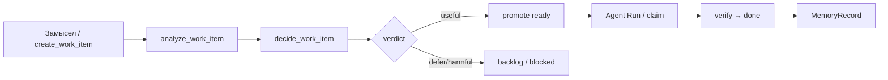

# Flow: от замысла до verified WorkItem

## Цель

Описать операторский путь Work Graph OS без свободного agent chat: намерение → backlog → execution → verification → memory.

## Почему

Продукт разделяет **intake** (Замысел), **planning queue** (Бэклог), **execution** (Доска + Agent Run) и **knowledge** (Память). Chat transcript нигде не является source of truth.

## Этапы

| Этап | UI / tool | Где хранится |
|------|-----------|--------------|
| 1. Задача | «Замысел» / `create_work_item` | `.work.bvc` BVC |
| 2. Анализ | карточка → «Запустить анализ» / `analyze_work_item` | секция **Анализ** в атоме |
| 3. Решение | useful / harmful / defer / `decide_work_item` | секция **Решение** + `work.decision.verdict` |
| 4. Ready | promote / `advance_work_pipeline` | `work.status: ready` |
| 5. Исполнение | Agent Run / `claim_work_item` | evidence + transitions |
| 6. Память | вкладка Память | MemoryRecord из done |

Протокол: [`protocols/work-item-decision-pipeline-v1.bvc`](../protocols/work-item-decision-pipeline-v1.bvc).  
Полный канон (analytics → epic → board → closing): [`docs/decision-pipeline-canon.md`](decision-pipeline-canon.md), [`protocols/decision-pipeline-canon-v1.bvc`](../protocols/decision-pipeline-canon-v1.bvc).

## Todo

- [x] Intent Composer MVP (protocol + API + UI)
- [x] Work-item decision pipeline (analyze/decide in atom + card UI + MCP)
- [ ] Agent Run preflight/explainability UX
- [ ] Optional: LLM provider hook in analyze (сейчас deterministic + переданный analysis text)

## Критерий завершения

Оператор может пройти путь «описал намерение → увидел задачу на доске → запустил run → нашёл запись в Памяти» без внешнего чата.
