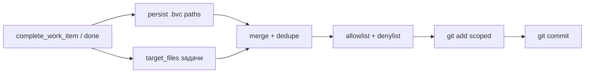

# AN-84: Git Snapshot на `done` — коммитить `work.target_files` вместе с задачей

**Запрос:** при закрытии задачи (`done`) в git попадают только `.bvc` из persist, а код из `work.target_files` — нет. Нужно, чтобы реализация коммитилась вместе с закрытием задачи. Это расширение модели безопасности AN-71.

**Дата:** 2026-06-07

**Связано:** [AN-71](work-graph-git-autocommit-on-events.md), [AN-83](git-snapshot-settings-ux-simplify.md), `epic-workgraph-git-snapshot-v1`, `epic-git-snapshot-ux-simplify-an83`

---

## Краткий вывод

Сейчас snapshot на `work_item.done` stage **только paths из persist result** (обычно `intent/**/work/*.work.bvc`). Поле **`work.target_files`** — метаданные связи задачи с кодом; в `git add` оно **не попадает**.

**Рекомендация:** на событии **`work_item.done`** объединять persist paths и **существующие** пути из `target_files` задачи (и rollup-детей при cascade), с **расширенным allowlist** и **denylist** для секретов/артефактов. Сохранить `requireCleanSubset`, `never push`, snapshot failure не блокирует `done`.

---

## Как сейчас

| Источник paths | Попадает в commit на `done`? |
|----------------|------------------------------|
| `persistedResults[].path` (`.work.bvc`) | Да |
| `work.target_files` (`src/…`, `tests/…`) | **Нет** |
| Несвязанные dirty-файлы в repo | Нет (scoped `git add -- path`) |

`isGitSnapshotPathAllowed()` разрешает только `intent/`, `work/`, `.work-graph/canon/` — поэтому даже явная передача `src/foo.mjs` в `paths` отклоняется.

---

## Целевое поведение

1. **Только `work_item.done`** — не на `status`, `created`, `analytics` (AN-83).
2. **Paths** = persist paths ∪ `item.targetFiles` (для rollup — union по всем закрытым items в batch).
3. **Фильтр:** файл существует; путь в allowlist; не в denylist; без wildcards/`..`.
4. **Опционально (MVP):** stage только файлы с **изменениями** относительно `HEAD` (working tree или index) — чтобы не шуметь пустыми путями.
5. **`requireCleanSubset=true`:** по-прежнему без `git add -A`; unrelated dirty не попадает.
6. **Ошибка git** → evidence `skipped`, `done` не откатывается.

---

## Модель безопасности (отличие от AN-71)

| AN-71 v1 | AN-84 |
|----------|-------|
| Только канон WG (`intent/`, `work/`) | + кодовые префиксы из `target_files` |
| Риск: минимальный (BVC/journal) | Риск: коммит **прикладного кода** при закрытии задачи |
| Оператор явно включал snapshot | После AN-83 defaults `enabled=true` |

**Denylist (обязательно):** `.env`, `.env.*`, `**/credentials*`, `node_modules/`, `dist/`, `build/`, `.git/`, бинарники без политики, пути вне корня репо.

**Allowlist для target_files (черновик):** `src/`, `tests/`, `e2e/`, `docs/`, `protocols/`, `schemas/`, `scripts/`, `packages/`, `public/`, `locales/`, `architecture/`, `.cursor/rules/` — конфигурируемо в policy, не хардкод в handlers.

**Продуктовое правило:** автокоммит кода = **намерение оператора**, зафиксированное в `target_files` атома; агент Cursor по-прежнему не коммитит сам по user rule — WG snapshot делает это как настройка репозитория.

---

## Риски

1. **Смешанный working tree** — в `target_files` указан `src/foo.mjs`, оператор правил `src/bar.mjs` → `bar` не попадёт (OK при subset).
2. **Устаревшие target_files** — пути в атоме не совпадают с реальными файлами → skip missing, commit по остальным.
3. **Слишком широкий allowlist** — случайный коммит `package-lock.json` / generated → denylist + policy review.
4. **Pre-commit hooks** — как в AN-71: fail → skipped evidence, не rollback `done`.

---

## MVP roadmap

| # | Задача | Файлы |
|---|--------|-------|
| 1 | Протокол + policy allowlist/denylist | `protocols/workgraph-git-snapshot-v1.bvc` |
| 2 | Сбор paths: persist ∪ targetFiles | `src/gitSnapshot.mjs` |
| 3 | Передача targetFiles из item на `done` | `packages/workgraph-mcp/src/handlers.mjs`, `src/intentTreeWorkItems.mjs` |
| 4 | Тесты: dirty tree, denylist, missing target | `tests/gitSnapshot.test.mjs`, runtime tests |

**Эпик:** `epic-git-snapshot-done-target-files-an84`

**Реализовано:** `epic-git-snapshot-done-target-files-an84` (2026-06-07) — `mergeGitSnapshotStagingPaths`, allowlist/denylist, wire в handlers + persist hook.

---

## Ссылки

- [AN-71: автокоммиты](work-graph-git-autocommit-on-events.md)
- `protocols/workgraph-git-snapshot-v1.bvc`
- `src/gitSnapshot.mjs` — `isGitSnapshotPathAllowed`, `maybeRunGitSnapshotAfterPersist`
