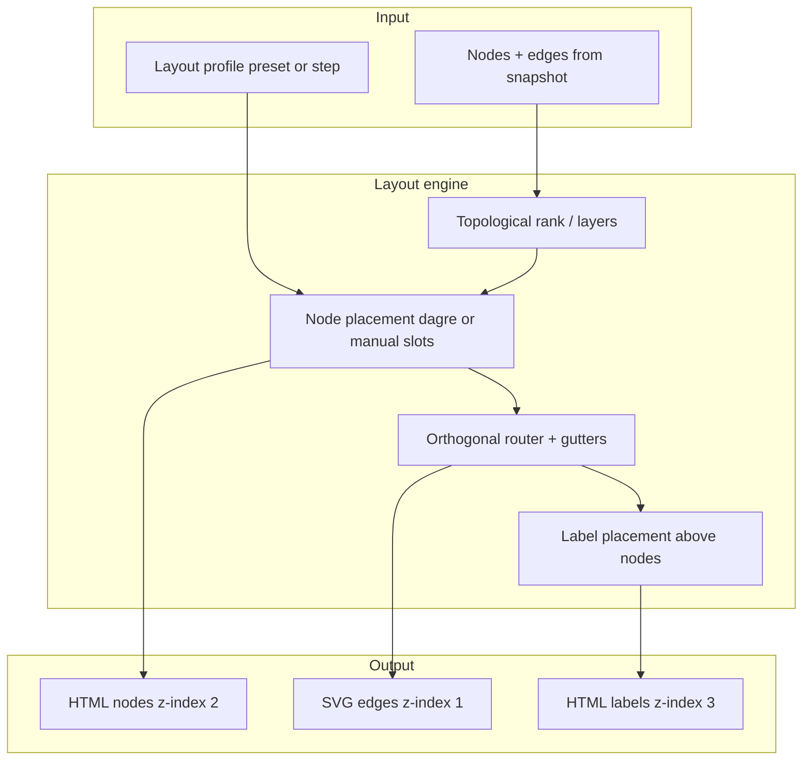

## Почему получается «каша»

Это не баг одной стрелки — **модель layout изначально слабая**: карточки и связи живут в разных системах координат, а граф сложнее, чем сетка, на которую его натянули.

### 1. Ручная сетка не совпадает с графом

И **Схема**, и **Дорожная карта** ставят блоки по жёсткой таблице `{ col, row }` (`POSITIONS` в `schematicView.mjs` и `architectureLayout.mjs`).

Позиции **не выводятся из рёбер**. Если ребро идёт по диагонали, назад или через «дыру» в сетке — линия **обязана** пересекать чужие карточки.

**Дорожная карта:** 5 блоков в верхнем ряду, в нижнем только 2 (col 1 и 3). Рёбра `work-graph → derived-projections`, `agent-runtime → domain-onebase`, `trace-evidence → derived-projections` — все **диагональные через пустоты и соседей**.

**Схема:** 13 рёбер, включая 4 «пересобирает» из storage вверх, петлю `evidence → work-graph`, параллельные связи в один блок. Сетка 4×3 для такого графа **геометрически тесная**.

### 2. Маршрутизация локальная, без обхода препятствий

Стрелка считается **только для пары from/to**: якорь + cubic bezier + простые «lanes». Нет:

- глобального планирования маршрутов;
- обхода bbox промежуточных карточек;
- минимизации пересечений;
- отдельных «коридоров» для upstream/downstream.

Поэтому каждая правка одной стрелки ломает соседнюю.

### 3. Карточки — «мини-статьи», а не узлы диаграммы

На canvas рендерится **title + layer + длинный summary + мета** (tasks/done/L2). Высота оценивается эвристикой по числу символов, а не по реальному DOM — в ряду блоки разной высоты, визуальный ритм ломается, якоря стрелок «плывут».

### 4. Два разных layout-движка в одном продукте

- L1: ручная сетка (`architectureLayout.mjs`, `schematicView.mjs`)
- L2 в drawer: **накопительный вертикальный stack** — там обычно аккуратнее, потому что layout **следует структуре дерева**

Плюс исторически геометрия дублировалась в inline-JS UI (часть уже вынесли, но паттерн хрупкий).

### 5. Один canvas — два смысла

**Дорожная карта** одновременно показывает:

- горизонтальный pipeline (canon → work → agent → trace → memory);
- доменный срез снизу (OneBase, Derived);
- обратные связи (`maps_to`).

Это **не один тип диаграммы**. Одна прямоугольная сетка не может честно показать и pipeline, и fan-in/fan-out, и upstream без компромиссов.

---

## Почему «просто поправить координаты» не работает

| Подход | Предел |
|--------|--------|
| Увеличить gap | Ширина/высота растут, диагонали остаются |
| Править якоря по одному ребру | 8–13 рёбер × N пересечений = бесконечный whack-a-mole |
| Фиксированная высота карточек | текст обрезается или вылезает |
| Больше colSpan/rowSpan | сетка становится разреженной, связи длиннее |

Нужен **layout, который учитывает граф**, а не наоборот.

---

## Решения (от быстрых к правильным)

### A. Быстрые (1–2 дня) — заметно чище без новых зависимостей

1. **Компактные узлы на canvas**  
   На схеме: `layer + title` (+ опционально 1 строка). Summary, tasks, L2 — только в drawer.  
   → одинаковая высота, меньше перекрытий, проще якоря.

2. **Перестроить slot-map под DAG, а не под «красивую таблицу»**  
   - Дорожная карта: верхний ряд = main pipeline; нижний = sidecars **под своими источниками** (OneBase под Work Graph, Derived под Trace — не под col 3).  
   - Схема: storage — отдельная «подложка» ниже, не colSpan поверх двух колонок; upstream-рёбра — в **левый/правый gutter**, не через центр.

3. **Routing gutters (коридоры)**  
   Зарезервировать пустые col/row или вертикальные полосы 24–40px **между колонками** — все межрядные стрелки идут только там. Orthogonal: down → corridor → across → down.

4. **Единый модуль `graphCanvasLayout.mjs`**  
   Общие: estimate height, row tops, edge lanes, label layer, orthogonal router. Схема и Architecture — только `nodes + edges + preset profile`.

### B. Средний срок (3–5 дней) — стабильный auto-layout

5. **Sugiyama / layered layout (dagre или elkjs)**  
   - Ранги по топологическому порядку (upstream рёбра — отдельный rank или dashed overlay).  
   - X распределяется автоматически, пересечения минимизируются.  
   - `dagre` — ~40KB, хорош для DAG; `elkjs` — мощнее (ports, sides), тяжелее.

6. **Orthogonal edge router поверх bbox**  
   После auto-layout: A* или простой Manhattan-router с обходом прямоугольников. Стрелки перестают резать карточки.

7. **Разделить upstream и downstream слои**  
   Сплошные — основной поток слева направо / сверху вниз. Пунктир (`rebuilds`, `maps_to`) — **нижний или левый gutter**, одним bus-line к цели. Визуально как в архитектурных схемах.

### C. Долгий (канон Work Graph) — layout как часть модели

8. **Layout profile в `.bvc` / snapshot**  
   ```yaml
   layout.profile: layered-dag-v1
   layout.ranks: { work-graph: 1, storage: 3 }
   layout.manualOverrides: { "domain-onebase": { col: 1, row: 2 } }
   ```  
   Auto-layout по умолчанию, ручные override для презентации.

9. **Два режима одной вкладки**  
   - **Pipeline** — только main path (5–7 узлов, одна линия).  
   - **Full graph** — все блоки с auto-layout.  
   Переключатель в UI, не одна перегруженная схема.

10. **Snapshot-тест на layout quality**  
    Метрики в CI: `edge_crossings ≤ N`, `min_gap ≥ 24px`, `no_label_under_node`. Регрессии ловятся тестом, не глазами.

---

## Рекомендация для проекта

**Сейчас (минимальный diff, максимум эффекта):**

1. Компактные карточки на canvas (summary в drawer).  
2. Пересобрать `POSITIONS` для Дорожной карты под реальные рёбра (OneBase под Work Graph, Derived под Trace/Agent).  
3. Gutter-routing для всех межрядных связей.  
4. Общий layout-модуль для Схемы и Дорожной карты.

**Следующий шаг (если граф будет расти):**

5. `dagre` layered layout + orthogonal router + upstream bus layer.

**Не делать:**

- бесконечно крутить bezier и gap вручную;
- пихать всё в одну плотную 4×N сетку с длинными summary.

---

## Целевая архитектура layout



---

**Порядок реализации:** A1 + A2 + A3 (компактные карточки, новые slots, gutter) — «прилично» без тяжёлых библиотек. **B5** — когда блоков станет больше 10 или появятся новые upstream-рёбра.
