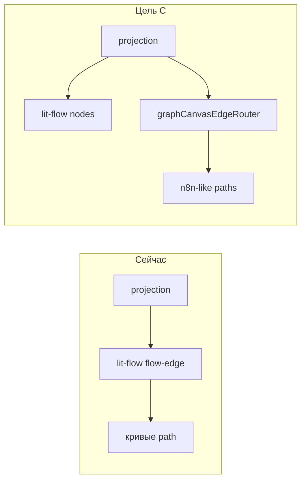

## Аналитический вопрос (AN-5)

Почему после миграции на **lit-flow** (AN-4) стрелки на **Граф намерений**, **Карта архитектуры** и **Схема** всё ещё **не как в n8n**: кривые L-path, пучки параллельных линий на вертикальной колонке задач, labels читаются хуже ожидаемого?

Контекст:

- **AN-1** — layout карточек и dagre spacing (узлы стали реже наезжать).
- **AN-4** — lit-flow для nodes/viewport/minimap; dagre + work-stack для intent roadmap.
- Несколько итераций правок (spacing, card height, smoothstep, кастомные handles) **не дали n8n-parity по рёбрам**.

**Вывод:** проблема не в dagre и не в размере карточек, а в **слое edge routing**.

---

## Почему предыдущие правки не помогли

| Что меняли | Эффект | Почему стрелки остались кривыми |
|------------|--------|----------------------------------|
| dagre spacing, `N8N_INSPIRED_DAGRE_LR` | узлы реже наезжают | path рёбер lit-flow не зависит от dagre |
| `layoutIntentRoadmapWorkStack` | колонка задач справа | вертикальные ребра идут через `smoothstep` |
| realistic card height, overlap resolver | меньше пересечений box'ов | SVG path считается отдельно |
| смена `default` / `smoothstep`, кастомные handles | задумка верная | **lit-flow игнорирует направление handle** |

---

## Корневая причина 1: баг lit-flow

В `lit-flow` → `flow-edge.js` при handle `source-bottom` / `target-top` координаты верные, но **Position всегда Right / Left**:

```javascript
// flow-edge.js (упрощённо)
getSourcePosition() {
  if (handlePos) return { ...handlePos, position: Position.Right }; // ← для bottom неверно
}
getTargetPosition() {
  if (handlePos) return { ...handlePos, position: Position.Left };  // ← для top неверно
}
```

`getSmoothStepPath` (@xyflow/system) при Right/Left **сначала рисует горизонталь**. На вертикальной колонке (dx ≈ 0, dy > 0) → L-образный path, визуально «рассыпанные» параллельные линии.

---

## Корневая причина 2: свой router не подключён

До lit-flow работал **`intentRoadmapEdgeGeometry`** (`src/intentRoadmapCanvas.mjs`):

- LR spine: bezier через середину (как n8n рабочий процесс edge);
- vertical stack: cubic bottom → top, bend 28–72px;
- anchor по центру карточки, rejected edges.

При миграции geometry **считается** в canvas model, но **`graphCanvasProjectionToFlow.mjs` не передаёт её** — рёбра рисует только lit-flow `<flow-edge>`.

---

## Референс n8n

```
Рабочий процесс JSON → dagre layout → nodes[] + edges[]
       ↓
@vue-flow/core (viewport, pan/zoom)
       ↓
@vue-flow/system: getBezierPath / getSmoothStepPath + корректные Handle.position
       ↓
CanvasEdge + DOM Card nodes
```

Ключевое: **Position handle = физический порт** (Top/Bottom/Left/Right). Layout и edge router — **разные слои**, согласованы между собой.

---

## Варианты решения

### A. Быстрый workaround (1–2 часа)

Vertical edges → `type: straight`, без `smoothstep` на колонке задач.

| Направление | type | handles |
|-------------|------|---------|
| dx > 35% width | `default` (bezier) | source / target (бок) |
| dy > 12, dx маленький | `straight` | source-bottom / target-top |

**Плюсы:** минимальный diff, убирает L-path.  
**Минусы:** без n8n-bend на вертикали; не использует `intentRoadmapEdgeGeometry`.

---

### B. Патч lit-flow (0.5–1 день)

Маппинг handle id → `Position.Bottom/Top/Left/Right` в `flow-edge.js`; опционально PR upstream.

**Плюсы:** smoothstep заработает для всех views.  
**Минусы:** patch `node_modules`, хрупко при обновлениях.

---

### C. Гибрид: lit-flow nodes + SVG edge layer (**рекомендуется**, 2–4 дня)

Как Phase A из AN-4 до полного lit-flow:

```
projection (x,y,width,height)
    ├─ lit-flow: карточки + pan/zoom + minimap
    └─ SVG overlay: graphCanvasEdgeRouter.mjs
           ← intentRoadmapEdgeGeometry + architecture lanes
           sync transform с viewport
```

1. `graphCanvasEdgeRouter.mjs` — обобщить `intentRoadmapEdgeGeometry`.
2. `mountGraphCanvasLitFlow.ts` — SVG layer, скрыть `flow-edges-layer`.
3. Подписка на viewport → пересчёт paths.
4. Vitest на path `d` для vertical + horizontal + rejected.

**Плюсы:** ближе всего к n8n; geometry уже есть и частично тестируется.  
**Минусы:** два слоя рендера.

---

### D. Один dagre на весь граф без work-stack (1–2 дня)

Убрать `layoutIntentRoadmapWorkStack`, всё через dagre LR/TB.

**Минусы:** регресс UX «колонка задач»; router всё равно нужен.

---

### E. Vue Flow / React Flow island (1–2 недели)

**Минусы:** второй фреймворк, out of scope для vanilla SSR UI.

---

## Рекомендация

| Приоритет | Вариант |
|-----------|---------|
| **1** | **C — гибрид SVG edges** |
| **2 (hotfix)** | **A — straight vertical** |
| **3** | B, D, E — техдолг / регресс / избыточно |



---

## Связь с другими AN

| AN | Связь |
|----|-------|
| AN-1 | layout карточек — необходим, но недостаточен для рёбер |
| AN-3 | intent graph model — topology колонки задач |
| AN-4 | lit-flow — **nodes/viewport ok; edges — отдельная задача AN-5** |

План исполнения (todo): [`docs/plan-graph-edges-n8n-parity.md`](../../docs/plan-graph-edges-n8n-parity.md)

---

## Todo

- [ ] Repro-тест: path для edge `epic → subtask` (vertical) в fixture intent roadmap
- [ ] (optional) Hotfix A: straight vertical в `graphCanvasProjectionToFlow`
- [ ] C1: `graphCanvasEdgeRouter.mjs`
- [ ] C2: SVG edge layer в `mountGraphCanvasLitFlow.ts`
- [ ] C3: architecture/schematic lanes в router
- [ ] C4: Vitest path quality
- [ ] C5: visual gate intent / architecture / schematic
- [ ] Обновить AN-4: «lit-flow = nodes/viewport; edges = Work Graph router»

---

## Критерий завершения AN-5

1. Вертикальная колонка задач: **одна** линия parent → child, bottom → top, без горизонтального хвоста.
2. LR spine: bezier как n8n, labels читаемы.
3. Ребро decision → epic: один path, без дублирования stroke.
4. Vitest зелёный; pan/zoom, minimap, keyboard nav не ломаются.

---

**Вердикт:** n8n-parity по стрелкам достигается не tuning dagre, а **отдельным edge router** (вариант C), с опциональным hotfix A. lit-flow оставляем для nodes и viewport.
