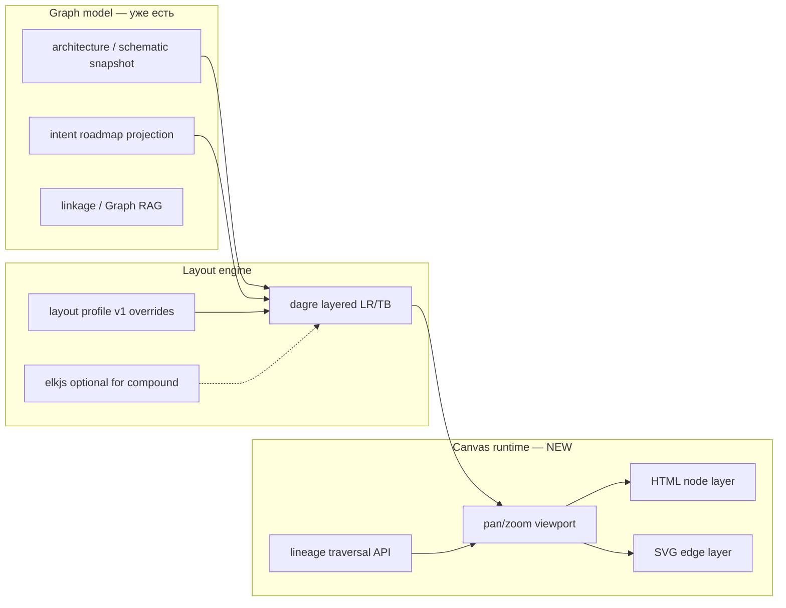

## Аналитический вопрос (AN-4)

Какой **движок интерактивных графов и схем** выбрать для Work Graph, чтобы карточки были кликабельными, layout масштабировался, а UX был сопоставим с **n8n рабочий процесс canvas** — без превращения markdown/Mermaid в runtime UI?

Контекст:

- **AN-1** закрыл layout profile, pipeline/full и метрики качества, но рендер остаётся **самописным HTML + SVG**.
- **AN-3** добавил intent roadmap canvas на **dagre LR**, но без pan/zoom, minimap, keyboard nav.
- Ошибка «вставить Mermaid в DOM» показала: **авто-диаграмма ≠ интерактивный graph engine**.

---

## Что нужно оператору (критерии «как n8n»)

| Свойство | n8n (Vue Flow) | Work Graph сейчас | Обязательно в AN-4 |
|----------|----------------|-------------------|---------------------|
| Клик по узлу → detail | ✅ | ✅ (drawer) | ✅ |
| Pan / zoom бесконечного canvas | ✅ | ❌ scroll контейнера | ✅ |
| fitView / центрирование | ✅ | ❌ | желательно |
| Minimap | ✅ | ❌ | опционально |
| Keyboard navigation по графу | ✅ | ❌ | желательно |
| Auto-layout слоёв (DAG) | ✅ (dagre) | частично (intent only) | ✅ везде |
| Orthogonal / bezier edges без пересечений карточек | ✅ | частично, локально | ✅ |
| Drag узлов оператором | ✅ | ❌ | опционально (override layout) |
| Drag-connect новых рёбер | ✅ | ❌ не нужно | ❌ read-only graph |
| Кастомные HTML-карточки (layer, status, progress) | ✅ node components | ✅ `<button>` | ✅ |
| Без React/Vue во всём приложении | N/A (Vue app) | ✅ vanilla SSR UI | ✅ или изолированный web component |
| Экспорт Mermaid / PNG | частично | Mermaid только docs | docs/export, не runtime |

**Вывод:** референс n8n — это не «Mermaid в UI», а **node-based canvas runtime**: viewport + layout engine + DOM-узлы + SVG-рёбра + interaction layer.

---

## Референс: как устроен canvas в n8n

С **n8n 1.44+** (2024) редактор переписан на **Vue Flow** (`@vue-flow/core`):

```
Рабочий процесс JSON (Pinia store)
        ↓
Canvas.vue + NodeView.v2.vue
        ↓
@vue-flow/core  ←→  custom CanvasNode / CanvasEdge components
        ↓
@vue-flow/system (headless: pan/zoom, drag, handles, edge paths, minimap)
        ↓
dagre / manual positions → nodes[] + edges[]
```

Ключевые паттерны n8n, которые стоит перенять:

1. **Разделение слоёв:** модель графа (nodes/edges) ≠ layout (x,y) ≠ viewport (pan/zoom) ≠ presentation (Vue components).
2. **Headless core:** `@vue-flow/system` — pan/zoom (`XYPanZoom`), path utils, hit-testing; UI — тонкая оболочка.
3. **Composables для обхода:** `useCanvasTraversal` — upstream/downstream/siblings для keyboard nav и highlight lineage.
4. **Custom nodes в Light DOM / HTML** — не один SVG-блок на всю схему.
5. **Layout через dagre** для layered DAG; ручной drag сохраняется в рабочий процесс state.
6. **Background grid + minimap + controls** — ориентация на больших графах.

Work Graph **не** строит рабочий процесс editor (нет connect handles, execute, node palette). Нужен **read-mostly lineage / architecture viewer** с тем же **ощущением canvas**.

---

## Текущий стек Work Graph

| View | Layout | Render | Interaction |
|------|--------|--------|-------------|
| Architecture | `graphCanvasLayout.mjs` (manual grid + ranks) | HTML buttons + SVG | click → drawer |
| Schematic | то же | то же | click → drawer |
| Intent roadmap | `dagreGraphLayout.mjs` LR | HTML buttons + SVG | click → task/intent drawer |
| L2 drawer stack | vertical tree | HTML list | click |

**Пробелы относительно n8n:**

- нет единого **viewport** (pan/zoom transform на canvas);
- три разных code path для edges (architecture / schematic / intent);
- layout engine не унифицирован: grid vs dagre;
- нет traversal API для lineage highlight;
- Mermaid есть в deps только для markdown preview — **не** для product canvas.

---

## Кандидаты (обзор движков)

### 1. Оставить custom + усилить (dagre/elk + d3-zoom)

**Суть:** общий `graphCanvasRuntime.mjs`: dagre/elk placement, orthogonal router, d3-zoom viewport, единые node/edge renderers.

| + | − |
|---|---|
| Нет нового фреймворка; уже есть dagre и паттерны | Всё interaction пишем сами (minimap, keyboard, selection) |
| Полный контроль над HTML-карточками | Риск повторить n8n с задержкой в 6–12 мес |
| Минимальный bundle | |

**Оценка:** хороший **Phase A** (1–2 недели), слабый **долгосрочный** UX ceiling.

---

### 2. @xyflow/system + Lit Web Components (lit-flow)

**Суть:** тот же headless core, что у React Flow / Vue Flow / **n8n**, но UI через **Web Components** (`lit-flow`, `@ghchinoy/litflow`) — без Vue/React во всём app.

| + | − |
|---|---|
| Близость к n8n по архитектуре | Lit — новая зависимость (изолированно в canvas panel) |
| Pan/zoom, drag, minimap из коробки | Экосистема меньше, чем React Flow |
| Кастомные node templates | Нужна интеграция с SSR `workGraphBacklogUiServer` (client hydrate island) |

**Оценка:** **лучший баланс** «как n8n» без смены стека всего UI.

---

### 3. Vue Flow (@vue-flow/core)

**Суть:** то, что использует n8n напрямую.

| + | − |
|---|---|
| Эталон UX; документация, примеры | Work Graph — vanilla Node SSR, не Vue SPA |
| | Отдельный Vue island или полная миграция панели |

**Оценка:** эталон для **копирования паттернов**, не для прямого embed без Vue runtime.

---

### 4. React Flow (@xyflow/react)

| + | − |
|---|---|
| Самая зрелая XYFlow-оболочка | React в проекте отсутствует |

**Оценка:** отклонить, если не планируется React-слой.

---

### 5. Cytoscape.js

**Суть:** зрелый graph engine: layouts (dagre, cose, …), pan/zoom, events, styling.

| + | − |
|---|---|
| Vanilla JS, один пакет | Узлы — в основном canvas/SVG styling, HTML overlay сложнее |
| Сильные layout algorithms | Менее «card-based» out of the box, чем Flow |
| Хорош для больших графов | Другая модель мышления vs n8n |

**Оценка:** сильный **Graph RAG / linkage** viewer; для card UI intent/architecture — второй выбор после Flow-family.

---

### 6. AntV X6 / G6

| + | − |
|---|---|
| Богатый node-based editor (X6) | Китайская документация, другой API стиль |
| HTML nodes, ports, routing | Тяжелее lit-flow для read-only case |

**Оценка:** альтернатива, если нужен editor-grade без XYFlow.

---

### 7. elkjs (ELK)

**Суть:** только layout (мощнее dagre: ports, sides, compound nodes).

| + | − |
|---|---|
| AN-1 уже упоминал elk | Не renderer; нужен свой canvas |
| Лучше fan-in/fan-out | ~1MB+ wasm, медленнее dagre |

**Оценка:** **layout backend**, не product engine. Комбинировать с п.1 или п.2.

---

### 8. Mermaid (runtime UI)

| + | − |
|---|---|
| Красивые статические схемы в md | **Нет** нативных кликабельных HTML-узлов |
| Уже в deps | Каждый клик/hit-test — костыли |

**Оценка:** **только** docs, export, analytics preview — **не** product canvas (урок intent roadmap).

---

### 9. Rete.js / LiteGraph / JointJS

Editor-centric, ориентированы на **создание** графов, не lineage viewer.

**Оценка:** избыточны для Work Graph read-mostly.

---

## Сравнительная матрица

| Движок | n8n-like UX | Vanilla / WC | HTML cards | Read-only fit | Усилие интеграции |
|--------|-------------|--------------|------------|---------------|-------------------|
| custom + dagre + d3-zoom | ★★★ | ★★★★★ | ★★★★★ | ★★★★★ | низкое |
| lit-flow / xyflow+Lit | ★★★★★ | ★★★★ | ★★★★ | ★★★★ | среднее |
| Vue Flow (n8n) | ★★★★★ | ★★ | ★★★★★ | ★★★★ | высокое |
| Cytoscape.js | ★★★ | ★★★★★ | ★★★ | ★★★★ | среднее |
| AntV X6 | ★★★★ | ★★★★ | ★★★★ | ★★★ | среднее |
| elkjs (layout only) | — | ★★★★★ | — | — | низкое (addon) |
| Mermaid UI | ★ | ★★★★ | ★ | ★★ | ❌ не подходит |

---

## Рекомендация

### Канон AN-4: **двухслойная архитектура**



### Phase A — унификация без нового фреймворка (1–2 спринта)

1. **`graphCanvasRuntime.mjs`** — единый viewport (d3-zoom или CSS transform), fitView, wheel pan.
2. **Единый edge router** — вынести `intentRoadmapEdgeGeometry` + architecture lanes в один модуль с orthogonal + obstacle avoidance.
3. **dagre LR по умолчанию** для architecture full graph и intent roadmap; pipeline mode — 1D как сейчас.
4. **`useGraphTraversal`-аналог** — upstream/downstream от выбранного узла (для drawer + highlight).
5. Mermaid — только `build*MermaidSource()` для analytics/export.

→ Закрывает 80% боли AN-1/AN-3 без смены стека.

### Phase B — n8n-parity runtime (2–4 спринта)

6. **Spike: lit-flow island** в `#architecture-canvas` / `#intent-roadmap-canvas` — client-side mount поверх JSON snapshot.
7. Кастомные Lit-узлы: те же CSS-классы карточек (`intent-canvas-node`, architecture block).
8. Minimap + keyboard nav — из `@xyflow/system` / lit-flow controls.
9. Manual drag → `layout.manualOverrides` в snapshot (уже предусмотрено AN-1).

→ Целевой UX **как n8n**, без Vue SPA.

### Phase C — по необходимости

10. **elkjs** для compound / multi-port схем (storage подложка, fan-in).
11. **Cytoscape** отдельно для Graph RAG linkage (100+ узлов), не для operator cards.

---

## Что не делать

- ❌ Mermaid как runtime UI для кликабельных схем.
- ❌ Три независимых edge/layout implementation без общего runtime.
- ❌ React/Vue migration всего backlog UI ради одной вкладки.
- ❌ Рабочий процесс editor features (connect handles, palette) — out of scope Work Graph.

---

## Связь с другими AN

| AN | Связь |
|----|-------|
| AN-1 | layout profile + pipeline/full — **input** для engine; AN-4 — **runtime renderer** |
| AN-3 | intent roadmap — первый потребитель dagre LR; AN-4 унифицирует с architecture |
| AN-2 | parent tree в backlog list; graph engine — **orthogonal** view того же lineage |

---

## Порядок реализации (кандидаты в бэклог)

| # | Work item (черновик) | Phase |
|---|----------------------|-------|
| 1 | спроектировать graph canvas runtime v1 (viewport, traversal, render contract) | A |
| 2 | реализовать единый graphCanvasRuntime + d3-zoom в architecture/schematic/intent | A |
| 3 | реализовать unified edge router (orthogonal, rejected/dashed, upstream bus) | A |
| 4 | перевести architecture full graph на dagre LR/TB через layout profile | A |
| 5 | spike lit-flow island для intent roadmap canvas | B |
| 6 | minimap + keyboard lineage nav (n8n parity) | B |
| 7 | optional elkjs для compound layout | C |

---

## Todo

- [x] Зафиксировать analytics record `analytics:graph-visualization-engine` (AN-4) в journal
- [x] Seed epic `implement-lit-flow-graph-canvas-v1` + 10 подзадач (`npm run seed:graph-visualization-engine`)
- [ ] Design: `protocols/graph-canvas-lit-flow-v1.bvc` + schema render contract
- [ ] Spike lit-flow в dev-ветке (1 canvas, 10 узлов, click → drawer)
- [ ] Решение go/no-go Phase B по результатам spike — **отменено: сразу lit-flow, без Phase A**
- [ ] Исполнить подзадачи epic в порядке depends_on

---

## Критерий завершения AN-4

1. Есть зафиксированный выбор: **Phase A now, Phase B target = lit-flow/XYFlow family, Mermaid = export only**.
2. Operator на «Схема» / «Дорожная карта» / intent roadmap имеет **pan/zoom** и **кликабельные карточки** без Mermaid DOM.
3. Один документ + protocol ссылаются на n8n как UX-референс, не как copy-paste Mermaid.

---

**Вердикт:** идеальный ориентир — **n8n = Vue Flow + @vue-flow/system + dagre + custom HTML nodes**. Для Work Graph эквivalent path — **lit-flow (Web Components) + dagre/elk + unified graphCanvasRuntime**, с Mermaid строго в analytics/docs.

**Продолжение:** рёбра после lit-flow — **[AN-5: graph-edges-n8n-parity](graph-edges-n8n-parity.md)** (root cause lit-flow handles, варианты A–E, рекомендация — гибрид SVG edge router).
