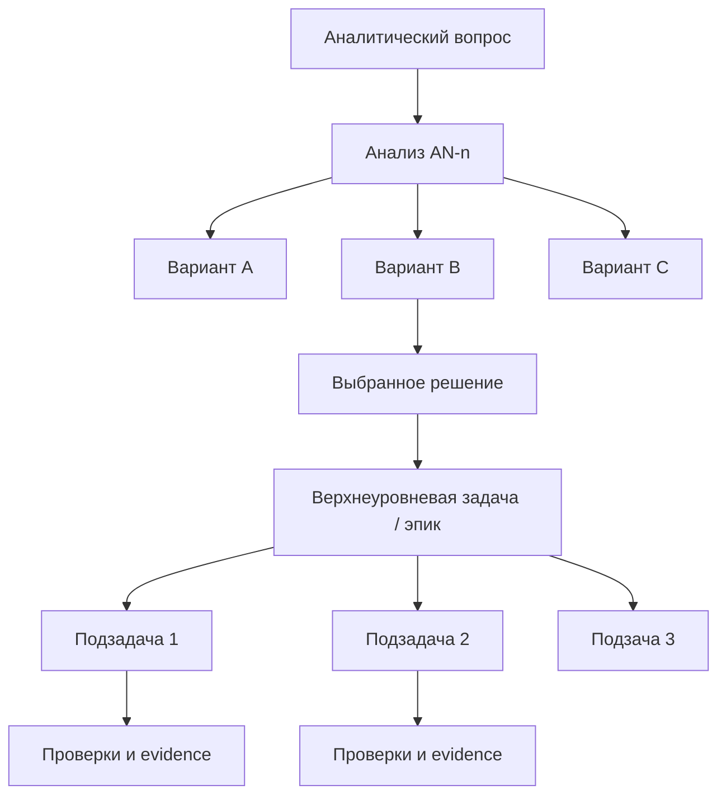

## Аналитический вопрос

Как хранить **граф намерений**, если работа начинается не с готовой задачи, а с вопроса:

> «Нужно ли нам сделать X? Какие есть варианты? Какой вариант выбрать? Какие задачи из него следуют?»

Сейчас Work Graph уже хранит WorkItem-атомы, аналитику AN-n и связи `depends_on`, но цепочка принятия решения разорвана:

- аналитический вопрос живёт в записи «Аналитика»;
- варианты решения живут в тексте разбора;
- выбранное решение вручную превращается в задачу;
- подзадачи появляются отдельными WorkItem;
- связь «этот эпик/таск родился из выбранного варианта в AN-n» видна только по тексту или intake-меткам.

Нужна модель, где **вопрос, варианты, решение, задача и подзадачи** являются узлами одного графа намерений.

---

## Что это будет: «Дорожная карта» или отдельная модель?

Это **не просто раздел “Дорожная карта”**.

Правильнее так:

- **Граф намерений** — каноническое хранилище смысла и решений.
- **Дорожная карта** — одно из представлений этого графа: выбранные решения, превращённые в эпики/задачи, разложенные по времени, статусу и зависимостям.
- **Аналитика** — входной слой: вопросы и разборы, из которых появляются кандидаты.
- **Бэклог** — исполнительный слой: задачи, подзадачи, статусы, проверки.

То есть раздел «Дорожная карта» должен читать граф намерений, но не быть единственным местом, где он живёт.

---

## Желаемая цепочка



Смысл этой схемы: задача не появляется «из воздуха». Она имеет lineage:

`question → analysis → option → decision → work item → subtask → evidence`

---

## Текущая модель

| Слой | Уже есть | Чего не хватает |
|------|----------|-----------------|
| Аналитика | `work/analytics-records.jsonl`, AN-n, markdown body | структурных узлов вариантов и выбранного решения |
| WorkItem | атомы `.work.bvc`, `basis/vector/goal`, `depends_on` | parent/subtask и ссылка на конкретный вариант решения |
| Intent tree | `intent/index.bvc`, папки по доменам | графа вопрос → решение → задача |
| Linkage | refs и derived projections | связи `derived_from`, `selected_option`, `implements_decision` |
| UI | вкладки «Аналитика», «Дорожная карта», drawer | единый углубление по lineage |

---

## Варианты хранения

### A. Только markdown в аналитике

В AN-n описывать вопрос, варианты и выбранное решение текстом. Задачи ссылаются на AN-n в basis.

**Плюсы:** работает сейчас, дешёво.  
**Минусы:** граф нельзя валидировать, фильтровать и показывать как lineage; агенту трудно безопасно добавлять подзадачи.

### B. Метки на WorkItem + structured summary в analytics record

В analytics record добавить структурный блок или sidecar:

```yaml
intent.question_id: iq:task-levels
intent.options:
  - id: option-a
    title: UI-only grouping
  - id: option-b
    title: work.parent_id
intent.selected_option: option-b
```

В WorkItem добавить метки:

```yaml
intake.analytics_key: AN-3
intent.question_id: iq:intent-graph-storage
intent.option_id: option-b
intent.decision_id: decision:intent-graph-storage-v1
work.parent_id: design-intent-graph-storage-v1
```

**Плюсы:** быстрый мост между аналитикой и задачами.  
**Минусы:** если структурный блок останется только в markdown, валидировать его сложнее.

### C. Отдельные IntentNode-атомы

Ввести канон `intent_node` рядом с WorkItem:

- `intent.node_kind: question | option | decision | work_ref | evidence_ref`
- `intent.id`
- `intent.parent_id`
- `intent.selected: true/false`
- `intent.links: ...`

WorkItem остаётся исполнительным атомом, а IntentNode хранит смысловую историю.

**Плюсы:** настоящий граф, валидируемые узлы, lineage в UI и Graph RAG.  
**Минусы:** новый профиль атома и миграция проекций.

### D. Событийный журнал intent graph

Хранить события:

- `question.recorded`
- `option.added`
- `decision.selected`
- `work_item.created_from_decision`
- `subtask.created`

Проекция строит текущий граф.

**Плюсы:** хорошо для аудита и восстановления решений.  
**Минусы:** сложнее редактировать руками; нужен projection layer.

---

## Рекомендация

Начать с **B → C**.

1. Сейчас: добавить structured intent metadata к analytics/work items, чтобы AN-n мог показывать созданные задачи и выбранный вариант.
2. Затем: вынести это в `intent_node` canon, если lineage начнёт использовать UI, агент и Graph RAG.

Почему не только дорожная карта:

- дорожная карта отвечает на вопрос «что делаем и в каком порядке»;
- граф намерений отвечает на вопрос «почему мы это делаем, какие варианты отвергли, из какого решения родились задачи».

---

## Как это должно выглядеть в UI

### Вкладка «Аналитика»

Внутри AN-n:

1. **Аналитический вопрос**
2. **Варианты решений**
3. **Выбранное решение**
4. **Задачи из решения**
5. **Подзадачи / прогресс**

### Вкладка «Дорожная карта»

Показывает только выбранную ветку:

`decision → epic → subtasks → done/evidence`

Отклонённые варианты не засоряют дорожную карту, но остаются доступны в аналитике.

### Вкладка «Граф намерений» (позже)

Отдельный graph view:

- questions;
- options;
- decisions;
- epics/tasks;
- evidence;
- связи `derived_from`, `selected_option`, `implements`, `blocked_by`.

---

## Канонические связи

| Связь | Откуда | Куда | Смысл |
|-------|--------|------|-------|
| `analyzes` | question | analytics record | вопрос разобран в AN-n |
| `offers_option` | analytics record | option | в разборе предложен вариант |
| `selects` | decision | option | выбранный вариант |
| `creates_work` | decision | WorkItem | решение стало задачей |
| `parent_of` | WorkItem | WorkItem | эпик содержит подзадачу |
| `depends_on` | WorkItem | WorkItem | порядок исполнения |
| `verified_by` | WorkItem | evidence | подтверждение выполнения |

---

## Что хранить в первом MVP

Минимальные поля:

```yaml
intent.question_id: iq:intent-graph-storage
intent.question: Как хранить граф намерений?
intent.option_id: option-b
intent.option_title: Structured metadata → IntentNode canon
intent.decision_id: decision:intent-graph-storage-v1
intent.decision_verdict: selected
intake.analytics_key: AN-3
intake.source_ref: analytics:intent-graph-storage-roadmap
```

Для подзадач:

```yaml
work.parent_id: design-intent-graph-storage-v1
intent.decision_id: decision:intent-graph-storage-v1
```

---

## Порядок реализации

| п. | Задача | Суть |
|----|--------|------|
| **12** | `design-intent-graph-storage-v1` | protocol: question/option/decision/work lineage |
| **13** | `implement-analytics-decision-structure` | structured options/selected decision в analytics projection |
| **14** | `implement-intent-lineage-labels-for-work-items` | labels на WorkItem: question_id, option_id, decision_id |
| **15** | `implement-roadmap-from-intent-graph-view` | дорожная карта как выбранная ветка intent graph |
| **16** | `implement-intent-graph-drilldown-ui` | вопрос → варианты → решение → задачи → evidence |

---

## Критерий завершения

AN-n становится не просто текстовым разбором, а входной точкой графа:

- видно исходный вопрос;
- видны варианты;
- виден выбранный вариант;
- видны задачи, созданные из решения;
- видны подзадачи и прогресс;
- дорожная карта показывает выбранную ветку, а не весь шум анализа.

---

**Итог:** это стоит оформить как **граф намерений**, а «Дорожная карта» должна быть его представлением. Первый практичный шаг — хранить structured decision metadata рядом с analytics/work items, затем вынести в отдельный `intent_node` canon.
