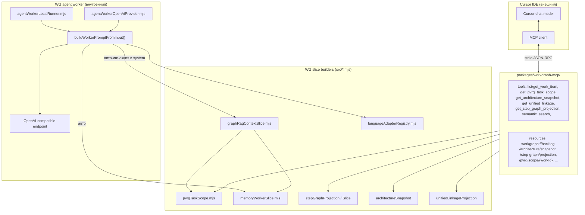

# AN-38: Как LLM использует PVRG, IR, срезы, memory в Work Graph

**Дата:** 2026-06-01 (rev. 2 — фокус: Work Graph, не ioHasC)  
**Запрос:** «как LLM (Cursor) сейчас использует PVRG, IR, срезы, memory — и использует ли вообще в Work Graph? есть ли польза?»  
**Scope:** репо `D:/Work/IDE/work graph`. ioHasC — **вне scope**, упоминается только как контраст.

---

## Короткий ответ

В Work Graph **два разных потребителя LLM**, и они потребляют разные срезы:

| Потребитель | Канал | Как «память» доходит до модели |
|-------------|-------|--------------------------------|
| **Cursor IDE** (внешняя модель Cursor'а) | `workgraph-mcp` stdio (`.cursor/mcp.json`) | **По вызову tool/resource** моделью — нет auto-инъекции в system prompt |
| **WG agent worker** (для claim/execute, eval) | `src/agentWorkerOpenAiProvider.mjs` | **Авто** в system prompt: Graph RAG + memory slice + target files + behavior rules |

**Итог по слоям:**

| Слой | LLM использует? | Польза |
|------|-----------------|--------|
| **PVRG task scope** (`pvrg.task-scope.slice.v1`) | Cursor: ✅ tool `get_pvrg_task_scope` (по запросу); Worker: ✅ внутри graph RAG | ⭐⭐⭐ — главный «что связано с задачей X» |
| **Graph RAG slice** (`pvrg.graph_rag.slice.v1`) | Cursor: ✅ `get_graph_rag_context` + resource; Worker: ✅ **авто в system** | ⭐⭐⭐⭐ для worker; ⭐⭐⭐ для Cursor |
| **Memory record slice** (`memory-worker.slice.v1`) | Cursor: ✅ `list_memory_records` / `get_memory_record` + resources; Worker: ✅ **авто в system** | ⭐⭐ для worker; ⭐⭐⭐ для Cursor |
| **Evidence records** (`evidence-record.v1`) | Cursor: ✅ `list_evidence_records` / `get_evidence_record` + resources | ⭐⭐ |
| **Step graph projection / slice** | Cursor: ✅ `get_step_graph_projection`, `get_step_graph_slice` | ⭐⭐ — карта `.bvc` блоков |
| **Architecture snapshot** | Cursor: ✅ `get_architecture_snapshot` (+ resource) | ⭐⭐⭐ — L1 блоки, L2 контейнеры |
| **Unified linkage** | Cursor: ✅ `get_unified_linkage` | ⭐⭐ — trace + planning edges |
| **Operator shell snapshot** | Cursor: ✅ `get_operator_shell_snapshot` | ⭐ — sidebar/cross-highlight (не для модели обычно) |
| **Target files (bounded read)** | Worker: ✅ авто (workGraphBoundedTargetFileRead) | ⭐⭐⭐ — содержимое файлов задачи |
| **Behavior rules bundle** | Worker: ✅ через `providerHints.behaviorRulesPrompt` | ⭐⭐ — prompt_rule contract |
| **IR / RichIR / TurIr** | ❌ нет identifier'ов в `src/` | — задел в `work/analytics/AN-9` без runtime |

**Вывод:** worker auto-инжектит graph RAG + memory в system prompt. Cursor получает **тот же derived context** через MCP (`get_graph_rag_context`, memory/evidence tools) — но **без auto-инъекции**; правило `.cursor/rules/work-item-claim-context.mdc` задаёт порядок вызовов перед claim. RichIR — deferred ([adr-an9-rich-ir-deferred.md](../../docs/adr-an9-rich-ir-deferred.md)).

---

## 1. Два канала LLM в Work Graph



**Ключевое различие:** worker строит prompt сам и **гарантированно** включает graph RAG. Cursor получает доступ к данным, но **полагается на модель** — она должна решить вызвать tool.

---

## 2. WG agent worker — что попадает в system prompt

`src/agentWorkerOpenAiProvider.mjs::buildWorkerPromptFromInput`:

```text
system = [
  'You are a Work Graph agent worker adapter.',
  'Respond with a single JSON object matching agent-worker.output.v1.',
  ... bounded target files content (formatBoundedTargetFilesForPrompt) ...
  ... language facts (formatLanguageFileFactsForPrompt) ...
  ... role chain передача hint ...
  ... contextSlices:
        formatGraphRagContextForPrompt(entry)    ← pvrg.graph_rag.context.v1
        formatMemoryWorkerSliceForPrompt(entry)  ← memory-worker.slice.v1
  ... if providerHints.behaviorRulesPrompt:
        'Behavior rules (prompt_rule bundle):'
        <текст бандла правил>
].join(' ')

user = JSON.stringify(input)  // agent-worker.input.v1
```

### Graph RAG context (auto)

`buildGraphRagSlice` собирает узлы:

- **WorkItem nodes** — id, title, status, ownerRole, dependsOn, targetFiles, traceStatus, blocker
- **FileArtifact nodes** — пути из `target_files`, adapterId, languageId
- **Evidence nodes** — из Evidence Record v1 для задачи
- **MemoryRecord nodes** — из `memoryRecordWriter` (записи, связанные с задачей)
- **Edges:** `depends_on`, `targets`, `has_evidence`, `cites_evidence`, `writes_memory`

Через **`buildGraphRagContextForWorkerInput`** worker получает context **детерминированно** для каждой claimed-задачи.

### Memory worker slice (auto, conditional)

`memoryWorkerSlice.mjs::buildMemoryWorkerSliceForTask`:

- Читает `memory-record-v1` записи из workspace
- Фильтрует по `sourceWorkItem`, `relatedTasks`, `dependsOn`
- В worker prompt попадает **только если** `recordCount > 0` (`agentWorkerLocalRunner.mjs:38`)

### Что **не** в worker system

- Полный backlog
- Step graph projection (доступен через MCP для Cursor, но не в worker prompt)
- Architecture snapshot
- Unified linkage projection

Worker работает **task-scoped** — только то, что относится к claimed task. Это правильно по design: prompt не раздут, retrieval через явную связь `depends_on` / `target_files`.

---

## 3. Cursor через `workgraph-mcp` — что доступно

Конфиг по умолчанию (`.cursor/mcp.json` в WG repo):

```json
{ "mcpServers": { "workgraph": { "type": "stdio", "command": "node",
  "args": ["${workspaceFolder}/packages/workgraph-mcp/src/index.mjs"] } } }
```

### Полный список MCP tools (15+)

| Tool | Schema / Output | Что даёт модели |
|------|-----------------|-----------------|
| `list_work_items` | filtered WorkItems | Backlog обзор |
| `get_work_item` | parsed WorkItem | Один пункт целиком |
| `read_work_item_atom` | raw `.work.bvc` text | Сырой атом для precise edits |
| `get_backlog_snapshot` | full runtime snapshot | Полная картина |
| `get_current_cycle` | ready/current/done | Текущий цикл |
| `get_promote_ready_queue` | promote-ready items | Что готово к ready |
| `get_epic_work_scope` | epic rollup | Дочерние пункты эпика |
| **`get_pvrg_task_scope`** | `pvrg.task-scope.slice.v1` | **Локальный subgraph задачи** (depends_on + target_files) |
| `get_architecture_snapshot` | `architecture.snapshot.v1` | L1 блоки, L2 контейнеры, edges |
| `get_unified_linkage` | `unified-linkage.projection.v1` | trace + planning edges |
| `get_step_graph_projection` | `step-graph.projection.v1` | refs между `.bvc` блоками |
| `get_step_graph_slice` | `step-graph.slice.v1` | bounded окрестность одного блока |
| `get_operator_shell_snapshot` | `operator-shell.snapshot.v2` | sidebar + cross-highlight |
| `semantic_search` | hybrid lexical BM25 TF-IDF | Поиск по WorkItems и target files |
| Transitions | `update_work_item_status`, `add_work_item_evidence`, `claim_work_item`, `complete_work_item`, `create_work_item` | Действия |

### MCP resources (для Cursor resource list)

`workgraph://backlog`, `workgraph://cycle/current`, `workgraph://intent/hierarchy`, `workgraph://architecture/snapshot`, `workgraph://linkage/projection`, `workgraph://step-graph/projection`, `workgraph://pvrg/scope/{workId}`, `workgraph://item/{workId}`.

### Что **не** в MCP

| Не экспонировано | Где живёт | Почему важно |
|-----------------|-----------|--------------|
| **Memory records** (`memory-record-v1`) | `src/memoryRecordWriter.mjs`, UI `/api/memory-records` | Cursor **не видит** durable память WG через MCP |
| **Graph RAG slice** (`pvrg.graph_rag.slice.v1`) | `src/graphRagContextSlice.mjs` (worker-only) | Cursor получает только PVRG task scope, не полный graph RAG с evidence/memory |
| **Evidence records** (`evidence-record-v1`) | `src/evidenceReadModel.mjs` | Через MCP отдельного tool нет |

**Это самые осязаемые «дыры» в Cursor surface** — есть [intent backlog](../../intent/research/pvrg/work/) items на портирование.

---

## 4. PVRG — детально

### Что есть

| Файл | Schema | Кто использует |
|------|--------|----------------|
| `src/pvrgTaskScope.mjs` | `pvrg.task-scope.slice.v1` | MCP `get_pvrg_task_scope`, UI `/api/pvrg-task-scope`, **worker через `buildGraphRagSlice`** |
| `src/graphRagContextSlice.mjs` | `pvrg.graph_rag.slice.v1`, `pvrg.graph_rag.context.v1` | **worker only** (`agentWorkerLocalRunner.mjs`, eval) |
| `src/onebasePvrgGraphNodes.mjs` | UI узлы для derived graph viewer | UI |
| `protocols/pvrg-graph-rag-minimal.bvc` | spec | dev reference |

### Польза по сценариям

| Сценарий | Через что | Польза |
|----------|-----------|--------|
| Cursor: «что блокирует задачу X» | `get_pvrg_task_scope` + `get_unified_linkage` | ⭐⭐⭐ — нативные WorkItem связи |
| WG worker: claim → execute | auto graph RAG в system | ⭐⭐⭐⭐ — задача + связанные WorkItems + evidence + memory без явных tool calls |
| Cursor: «общая карта проекта» | `get_step_graph_projection` | ⭐⭐ — graph по `.bvc` файлам |
| Cursor: «архитектурный блок derived-projections» | `get_architecture_snapshot{focusBlockId}` | ⭐⭐⭐ — L1 + L2 + tasks |

### Чего PVRG в WG **не делает**

- **Нет file-level call graph** (как у ioHasC `pvrgPanel`) — это task-graph по `depends_on` + `target_files`
- **Нет live кода scanning** — все срезы derived из BVC/snapshot
- В Cursor: модели нужно явно запросить slice — нет auto-инъекции

---

## 5. IR / RichIR / TurIr в Work Graph

### Что есть в коде

| Identifier | В `src/`? | Где упоминается |
|-----------|----------|-----------------|
| `RichIR` | ❌ | `work/analytics/ir-rich-ir-открытый канон.md` (**AN-9**), `unique-tech-stack-meta-review.md`, `pvrg-verified-reference-graph.md`, `other-unique-technologies-overview.md` |
| `TurIr` / `turIr` | ❌ | те же analytics docs |
| `IR` как формат WorkItem | — | каждый `.work.bvc` атом — это «IR» в смысле intermediate representation для backlog |

### Что это значит для LLM

- **AN-9 (IR/RichIR открытый канон)** — research-level analytics, **в код WG не вошло**
- LLM (Cursor или worker) **не получает** RichIR-структуру; модель видит работу с BVC-атомами как с текстом
- Если под «IR» имеется в виду **`agent-worker.input.v1` / `agent-worker.output.v1`** — это есть, и это и есть «IR» для worker (см. schemas/`agent-worker.{input,output}.v1.schema.json`)

**Оценка:** «RichIR» в WG runtime **не используется**. То, что реально работает как IR — это **WorkItem JSON** и **Worker input/output schemas**.

---

## 6. Memory в Work Graph

### Слои

| Слой | Единый источник правды | Кто читает |
|------|-----------------|-----------|
| **MemoryRecord v1** (`protocols/project-memory-v1.bvc`) | `.work.bvc` записи + derived JSON | `memoryRecordWriter`, `memoryWorkerSlice`, UI |
| **Memory worker slice** | `src/memoryWorkerSlice.mjs` | **WG worker prompt (auto)** |
| **Memory panel projection** | `/api/memory-records` | UI :4177 |
| **Architecture L1 canon** | `architecture/main.bvc` | UI, MCP `get_architecture_snapshot` |

### Где LLM реально видит memory

1. **WG worker** — `formatMemoryWorkerSliceForPrompt(entry)` **в system** если `recordCount > 0`. Включает type, summary, sourceWorkItem, evidenceIds. ⭐⭐⭐ польза для claim/execute.
2. **Cursor** — **нет** MCP tool для `memory-record-v1`. Модель может косвенно получить часть memory через `get_pvrg_task_scope` (если узлы попали в slice), но не как первичный канал.

### Пробел

Backlog item `implement-pvrg-graph-rag-context-slice` (`src/workItemTextRusify.mjs:438`) — реализация Graph RAG context для **MCP** (сейчас только worker). После него Cursor получит memory автоматически.

---

## 7. Срезы (slices) — реестр

| Schema | Builder | MCP tool | Worker auto | UI API |
|--------|---------|----------|-------------|--------|
| `workgraph.snapshot.v1` | `workGraphRuntime.mjs` | `get_backlog_snapshot` | косвенно (через graph RAG) | `/api/backlog-snapshot` |
| `pvrg.task-scope.slice.v1` | `pvrgTaskScope.mjs` | ✅ `get_pvrg_task_scope` | ✅ через `buildGraphRagSlice` | `/api/pvrg-task-scope` |
| `pvrg.graph_rag.slice.v1` | `graphRagContextSlice.mjs` | ❌ | ✅ | ❌ |
| `pvrg.graph_rag.context.v1` | `graphRagContextSlice.mjs` | ❌ | ✅ (формат для prompt) | ❌ |
| `memory-worker.slice.v1` | `memoryWorkerSlice.mjs` | ❌ | ✅ | ❌ |
| `memory-panel.projection.v1` | UI server | ❌ | ❌ | ✅ `/api/memory-records` |
| `evidence-record.v1` | `evidenceReadModel.mjs` | ❌ (нет tool) | ✅ через graph RAG nodes | косвенно |
| `architecture.snapshot.v1` | `architectureSnapshot.mjs` + `architectureL1Canon.mjs` | ✅ `get_architecture_snapshot` | ❌ | ✅ |
| `unified-linkage.projection.v1` | `unifiedLinkageProjection.mjs` | ✅ `get_unified_linkage` | ❌ | ✅ |
| `step-graph.projection.v1` | `stepGraphProjection.mjs` | ✅ `get_step_graph_projection` | ❌ | ✅ |
| `step-graph.slice.v1` | `stepGraphSlice.mjs` | ✅ `get_step_graph_slice` | ❌ | ✅ |
| `operator-shell.snapshot.v2` | `operatorShellProjection.mjs` | ✅ | ❌ | ✅ |
| `intent.hierarchy.snapshot.v1` | — | ✅ `get_intent_hierarchy` | ❌ | ✅ |

**Картина:** worker концентрирует **task-scoped** срезы (Graph RAG + memory); MCP даёт Cursor **обзорные** срезы (architecture, step-graph, linkage) + точечный PVRG scope.

---

## 8. Польза: использует ли вообще?

### WG agent worker — **да, активно**

- Каждый claim/execute раунд → `buildWorkerPromptFromInput` → graph RAG + memory **гарантированно в system prompt**
- Это не «опция», это контракт worker'а
- **Польза:** ⭐⭐⭐⭐ — модель видит связанные задачи, файлы, evidence без явных tool calls; output schema `agent-worker.output.v1` детерминирован
- Тесты: `tests/graphRagContextSlice.test.mjs`, `workGraphLlmUsefulnessEval.mjs`

### Cursor IDE — **частично, по запросу**

- MCP tools доступны, но **модель должна сама вызвать** — нет auto-инъекции
- Resources видны в Cursor MCP resource picker, но не auto-injected
- **Польза реальная** если в правиле Cursor/`AGENTS.md` явно прописано «вызови `get_pvrg_task_scope` для задачи X» или модель сама проактивна
- **Тесты MCP:** `tests/workgraph-mcp.test.mjs`, `workgraph-mcp-stdio.test.mjs`

### Замеры

- `workGraphLlmUsefulnessEval.mjs` уже проверяет факт включения PVRG task scope schema в worker prompt (line 153–154)
- Cursor MCP usefulness — **не замерян автоматически**, только в UAT

---

## 9. Дыры и рекомендации (только для Work Graph)

| Приоритет | Тема | Где |
|-----------|------|-----|
| **P1** | Портировать `graphRagContextSlice` в MCP (tool `get_graph_rag_context`) | intent: `implement-pvrg-graph-rag-context-slice` |
| **P1** | Memory MCP tools (`list_memory_records`, `get_memory_record`) | сейчас только UI/worker |
| **P2** | Evidence MCP tool (`list_evidence`, `get_evidence`) | косвенно через graph RAG |
| **P2** | Cursor rule в `.cursor/rules` — «всегда читай pvrg task scope перед claim» | повысит usefulness без auto-инъекции |
| **P3** | E2E замер Cursor MCP usefulness (как `workGraphLlmUsefulnessEval` делает для worker) | сейчас только UAT |
| **—** | IR/RichIR | **research-only**, runtime hook отсутствует; решение — отложить или закрыть AN-9 как deferred |

### Что **не** надо делать

- Дублировать Architecture Memory v1 как в ioHasC — у WG другая модель (task-scoped, не project-level)
- Auto-инъектировать в Cursor system prompt — это вне нашего контроля (Cursor сам решает)
- RichIR runtime до явного use-case

---

## 10. Перепроверка ключевых claims (по коду WG)

| Claim | Источник | Verdict |
|-------|----------|---------|
| Cursor MCP — stdio через `packages/workgraph-mcp/src/index.mjs` | `.cursor/mcp.json` | ✅ |
| Tool `get_pvrg_task_scope` зарегистрирован | `packages/workgraph-mcp/src/index.mjs:121` | ✅ |
| Worker auto-инжектит Graph RAG в system | `agentWorkerOpenAiProvider.mjs:135` `formatGraphRagContextForPrompt(entry)` | ✅ |
| Worker auto-инжектит memory slice если есть records | `agentWorkerLocalRunner.mjs:38` `if (memoryWorkerSlice.recordCount > 0)` | ✅ |
| Memory MCP tool **отсутствует** | grep `workgraph-mcp` — нет `memory_record` tool | ✅ |
| Graph RAG MCP tool **отсутствует** | grep — нет `get_graph_rag` | ✅ |
| `RichIR` / `TurIr` identifier в `src/` | grep — 0 совпадений (только analytics docs) | ✅ |
| `pvrg.graph_rag.context.v1` существует | `graphRagContextSlice.mjs:7` | ✅ |
| `memory-record-v1` контракт реален | `protocols/project-memory-v1.bvc` | ✅ |
| Worker `agent-worker.{input,output}.v1` schemas | `agentWorkerOpenAiProvider.mjs:15-16` | ✅ |

---

## feeds_epics

**Closed:** `epic-cursor-mcp-context-surface-v1` (2026-06-01) — см. [closing-epic-cursor-mcp-context-surface-v1.md](closing-epic-cursor-mcp-context-surface-v1.md).

RichIR runtime — deferred per [docs/adr-an9-rich-ir-deferred.md](../../docs/adr-an9-rich-ir-deferred.md).
