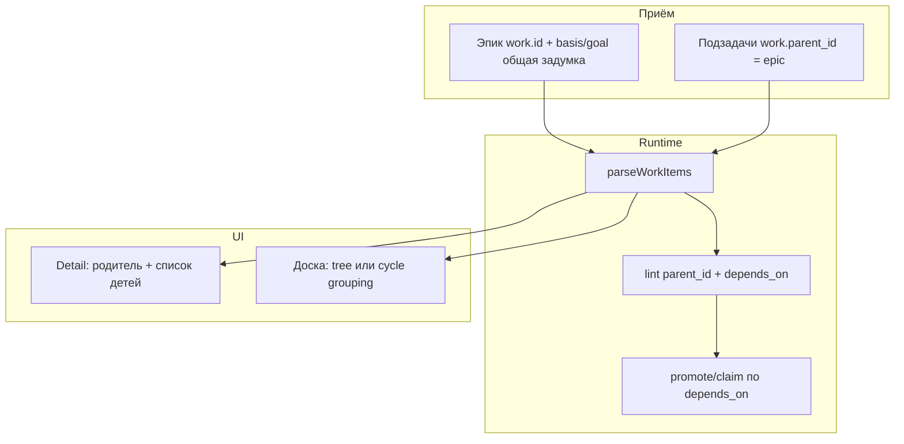

## Зачем нужны уровни задач

Сейчас бэклог Work Graph **плоский**: каждая карточка — отдельный атом с basis/vector/goal, а связь между задачами выражается только через `depends_on` (кто **должен завершиться раньше**). Это хорошо для execution gate, но **плохо для смысла**:

- оператор не видит **общую задумку** эпика в одном месте;
- подзадачи размазаны по intent tree и cycle slice;
- в detail drawer нет «родителя» с контекстом «зачем всё это»;
- `depends_on` нельзя подменять родительством: sibling-подзадачи не должны блокировать друг друга только потому, что они «внутри одного эпика».

**Запрос:** верхнеуровневая задача с подзадачами, где в описании родителя понятна общая задумка, а дети несут исполнение.

---

## Что уже есть (и чем не является иерархия)

| Механизм | Что даёт | Чего не даёт |
|----------|----------|--------------|
| `work.depends_on` | порядок исполнения, promote/claim gate | композицию «эпик → подзадачи» |
| `phase-N-*` work id | cycle slice на доске | явный parent/child в атоме |
| `intent/{layer}/…/work/` | таксономия папок | логическое дерево задач |
| basis/vector/goal в каждом атоме | локальный контекст | rollup общей задумки |

**Вывод:** иерархию нужно добавлять **отдельным полем**, не ломая `depends_on`.

---

## Риски наивных решений

| Подход | Проблема |
|--------|----------|
| Использовать `depends_on` как parent | подзадачи начнут блокировать друг друга; эпик превратится в цепочку |
| Хранить `children[]` в атоме | дублирование, рассинхрон при move/rename work.id |
| Только UI-группировка по cycle | не видно в MCP, lint, linkage graph |
| Родитель без собственного basis/goal | пустые «папки» без смысла для оператора |

---

## Решения (от быстрых к канону)

### A. Быстро (1–2 дня) — смысл без новой схемы

1. **Эпик-задача с явным basis «общая задумка»**  
   Родитель — обычный WorkItem с развёрнутым basis/goal; дети ссылаются на него текстом в basis (`см. work.id epic-…`).  
   → работает уже сейчас, но без машинной связи и дерева в UI.

2. **UI: группировка по `work.cycle` / phase epic**  
   На доске сворачивать задачи одного cycle под заголовком phase.  
   → визуально ближе к дереву, но cycle ≠ произвольный эпик.

### B. Средний срок (3–5 дней) — `work.parent_id`

3. **Метка `work.parent_id: <work.id>` в атоме**  
   - один родитель на задачу;  
   - дети **не хранятся** — выводятся scan по всем items;  
   - lint: parent существует, нет циклов parent↔child, parent ≠ self.

4. **Родительский атом — контейнер смысла**  
   Поля basis/vector/goal родителя = **общая задумка**; у детей — узкий scope + ссылка на parent в basis.  
   Статус родителя: display rollup (все дети done → родитель можно закрыть) **или** только gate на promote детей.

5. **Detail drawer: блок «Подзадачи»**  
   Список children под родителем; у child — ссылка «Родитель: …» с переходом в drawer.

6. **MCP `create_work_item` + `parentId`**  
   При создании подзадачи автоматически проставлять `work.parent_id` и intake provenance.

### C. Долгий (канон Work Graph)

7. **Protocol `work-item-hierarchy-v1.bvc`**  
   Семантика: `work.item_kind: epic | task | subtask`; правила rollup, promote, evidence.

8. **Linkage graph: `parent_of` / `child_of`**  
   Рядом с `depends_on` в unified linkage и Graph RAG slice.

9. **Board tree mode**  
   Kanban с expand/collapse эпиков; фильтр «только верхний уровень / с детьми».

10. **Snapshot-тест и lint tier**  
    `lint:backlog` ловит orphan parent_id, циклы, epic без children (warning).

---

## Рекомендация для проекта

**Да, уровни задач делаем.** Минимально жизнеспособный путь:

1. **`work.parent_id`** + derived children (блок B п.3–5).  
2. **Родитель обязан иметь basis/goal с общей задумкой** — это не пустая папка.  
3. **`depends_on` оставить для порядка исполнения** между подзадачами и внешними deps.  
4. **Rollup v1 — display-only:** UI показывает прогресс `N/M детей done`; жёсткий gate «родитель done только когда все дети done» — фаза C.

**Не делать сейчас:**

- хранить `children[]` в атоме;
- смешивать parent_id и depends_on в одно поле;
- автogenerировать текст родителя без участия оператора/агента.

---

## Целевая модель

---

## Порядок реализации (seed из блока C)

| п. | Work item | Суть |
|----|-----------|------|
| **8** | `design-work-item-hierarchy-v1` | protocol + schema: `work.parent_id`, `work.item_kind`, lint rules |
| **9** | `implement-work-item-parent-id-runtime` | parse, lint, MCP create_work_item.parentId |
| **10** | `implement-backlog-ui-parent-child-tree` | drawer «Подзадачи», ссылка на родителя, rollup N/M |
| **11** | `implement-linkage-parent-of-edges` | unified linkage + тесты parent_of |

**Связь с AN-1:** layout/graph — отдельная ось; иерархия задач улучшает **смысл и навигацию** бэклога, не заменяя graph canvas layout.

---

**Итог:** верхнеуровневая задача + подзадачи **реализуемы** через `work.parent_id` и derived children; общая задумка живёт в basis/goal родителя; подзадачи наследуют контекст через parent link и собственный узкий scope.
