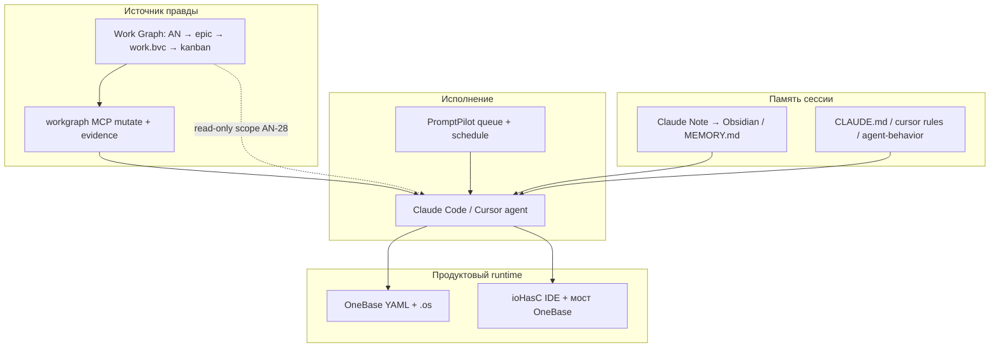

# AN-31: PromptPilot и Claude Note vs Work Graph (контекст OneBase / Infostart)

**Запрос:** «изучи статью https://infostart.ru/1c/articles/2694204/ — там есть ссылки на Claude Note и ещё что-то, сравни их с Work Graph» → «оформи это как AN-31».

**Источники:**
- [OneBase: с открытым исходным кодом 1С-подобная платформа](https://infostart.ru/1c/articles/2694204/) (Ivan Titov, 2026)
- [PromptPilot: менеджер задач для Claude Code, Codex и других CLI](https://infostart.ru/1c/articles/2653416/)
- [Claude Note — каждая сессия с Claude Code становится знанием](https://infostart.ru/1c/articles/2659511/)

## Кратко

Автор OneBase закрывает две боли AI-разработки **двумя внешними инструментами**, а не PM-слоем:

| Инструмент | Слой | Что решает |
|---|---|---|
| **PromptPilot** | Execution queue | Когда и какой промпт отправить в CLI-агента (расписание, Telegram, rate limit) |
| **Claude Note** | Session memory | Что агент «запомнил» из прошлой сессии (`MEMORY.md`, Obsidian) |
| **Work Graph** | учёт работ и прослеживаемость | Что **обязано** быть сделано, с `work.id`, evidence и kanban |

Это **комplement**, не замена: PP ≠ backlog, CN ≠ work items. Риск — **triple backlog** (PP jobs + CN notes + WG `.work.bvc`), если не зафиксировать границы. Рекомендация: WG — единственный бэклог; PP — optional execution adapter по `ready`; CN — exploratory sessions без `work.id`; итоги с `work.id` → AN + closing, не только Obsidian.

OneBase (продукт статьи) и Work Graph — **разные уровни**: runtime ERP vs agent-OS / PM. Связка уже описана в [AN-17](onebase-integration-vertical-stack.md) и [AN-21](marketplace-integration-and-shared-design-system.md).

---

## 1. Контекст статьи OneBase

### 1.1. Две боли автора

1. **Лимиты подписок** сгорают «не вовремя» — ночью, в дороге, когда нет терминала.
2. **Агент забывает контекст** после summary / новой сессии Claude Code.

### 1.2. Его стек до OneBase

- **PromptPilot** — очередь промптов для Claude Code / Codex / Qwen: SQLite, worker (subprocess), Web UI, Telegram, cron, retry при rate limit, продолжение диалога из бота.
- **Claude Note** — daemon после сессии CC: анализ транскрипта → структурированные заметки (Obsidian) + **`MEMORY.md`** в проект для следующей сессии; опционально qmd для семантики и анти-дубликатов.

### 1.3. Рабочий процесс в комментариях (multi-LLM)

- **Opus** — планы и обсуждение.
- **GLM 5.1** — код, review, иногда merge.
- Трёхкратный проход (code → review без контекста → merge) ловит ошибки.

Формального epic/subtask/evidence контура в статье **нет** — это pet-project PM «в голове агента + заметки + очередь промптов».

---

## 2. PromptPilot — разбор

### 2.1. Архитектура (по материалу Infostart)

| Компонент | Назначение |
|---|---|
| SQLite | Очередь jobs (промпт, cwd, agent type, schedule) |
| Worker | Один job за раз → subprocess CLI (`claude`, `codex`, …) |
| CLI `pp add` | Постановка задачи с `--dir`, `-a` (время), recur |
| Web UI | Kanban-подобный просмотр jobs, pilot.our24.ru |
| Telegram bot | Постановка задач и продолжение диалога без консоли |
| Rate limit | Retry / отложенный запуск |

### 2.2. Типовые кейсы автора

- «Разогреть» лимит к 5:00 лёгким промптом.
- Поставить задачу из Telegram в дороге.
- Ночью «сжечь» квоту очередью TODO-промптов.

### 2.3. Сравнение с Work Graph

| Ось | PromptPilot | Work Graph |
|---|---|---|
| **Единица учёта** | Job / промпт | `work.id` в `intent/**/work/*.work.bvc` |
| **Персистентность** | Локальная SQLite | Git + `analytics-records.jsonl` |
| **Статус «готово»** | Job completed / error | `work.status: done` + **Свидетельства** + lint |
| **Операторская доска** | Web/TG kanban jobs | Центр управления, kanban, Intent Roadmap |
| **Связь с анализом** | Нет AN → epic | [AN-22 pipeline](../docs/decision-pipeline-canon.md) |
| **Scheduling** | Cron, «разогреть лимит» | `agentWorkerLiveLoop`, daemon tick — про **исполнение WG**, не квоты провайдера |
| **Mutate policy** | Любой промпт в очередь | MCP gates, no TodoWrite sync ([AN-25](agent-bypass-work-graph-dual-backlog.md), [AN-28](chat-work-graph-todo-sync.md)) |
| **Multi-project** | Projects в PP | `intent/domains/*`, domain work trees |

**Вывод:** PromptPilot — **исполнительный планировщик CLI-агента** (WHEN + WHICH PROMPT). Work Graph — **источник правды о работе** (WHAT + DONE + PROOF). Пересечение только если оба ведут списки «что делать» без связи → **dual backlog** (см. AN-25).

### 2.4. Рекомендуемая граница

```
PromptPilot job payload  →  "Execute work.id epic-foo-subtask-bar from WG ready queue"
Status in WG             →  only via MCP (claim / complete), never PP job status alone
```

---

## 3. Claude Note — разбор

### 3.1. Архитектура (по материалу Infostart)

| Компонент | Назначение |
|---|---|
| Daemon | Следит за завершением сессий Claude Code |
| Synthesis | LLM сжимает транскрипт → структурированные заметки |
| Obsidian vault | Человекочитаемая база знаний |
| `MEMORY.md` | Автоподгрузка в следующую сессию CC |
| qmd (optional) | Семантический поиск по заметкам, анти-дубликаты |

Пример содержимого `MEMORY.md` в статье — правила 1С (MCP-серверы, зарезервированные слова, синтаксис запросов, XML форм). Это **domain knowledge**, не task state.

### 3.2. Сравнение с Work Graph

| Ось | Claude Note | Work Graph |
|---|---|---|
| **Что сохраняет** | Insights из **диалога** | Решения в **AN-XX**, эпики, BVC, closing |
| **Память агента** | `MEMORY.md`, Obsidian | `rules/agent-behavior`, `.cursor/rules`, architecture memory, project passport |
| **Формат** | Narrative markdown | `.work.bvc`, JSONL, lint, MCP read API |
| **Забывание сессии** | ✅ Решает (distilled memory) | ✅ Решает через **артефакты**, не chat memory |
| **«Задача закрыта»** | Не моделирует | `done` + evidence timeline |
| **Exploratory work** | ✅ Удобно (час копали API — note) | ⚠️ Без work item — только AN intake |

**Вывод:** Claude Note — **мягкая память сессии** («что поняли»). Work Graph — **жёсткий контур работы** («что обязаны сделать и доказать»). Пересечение: оба пишут «правила для агента» → риск **дублирования** с `claude.md` / cursor rules / `MEMORY.md`.

### 3.3. Рекомендуемая граница

| Сессия | Куда итог |
|---|---|
| Разведка без scope | Claude Note → Obsidian (ok) |
| Subtask с `work.id` | Evidence в `.work.bvc` + при эпике **closing AN** |
| Повторяющееся правило для агента | Promote: `rules/agent-behavior/*.bvc` или `.cursor/rules`, не только MEMORY |

Closing-документы (AN-29, AN-30) уже выполняют роль «Claude Note на стероидах» — с трассировкой `work.id` и feeds_epics.

---

## 4. Слои в одной схеме



---

## 5. Рабочий процесс автора OneBase vs канон Work Graph

| Практика автора | Эквивалент / усиление в WG |
|---|---|
| Opus пишет план в чате | **AN intake** → epic + subtasks ([AN-22](../docs/decision-pipeline-canon.md)) |
| GLM кодит и ревьюит | Multi-model roles (ADR deferred в ioHasC); разные роли на разных этапах pipeline |
| Тройной проход code/review/merge | Verification matrix + отдельные work items «review» / «merge» с evidence |
| PromptPilot ночная очередь | Optional: jobs только по `ready` из WG |
| Claude Note MEMORY | Promote в rules; closing AN для эпиков |
| OneBase как продукт | [AN-17](onebase-integration-vertical-stack.md): мост в ioHasC, не замена WG |

---

## 6. Связанные материалы из экосистемы статьи

| Материал | Роль | vs Work Graph |
|---|---|---|
| [Infostart MCP для 1С](https://infostart.ru/1c/articles/) (блок «См. также») | MCP: метаданные / синтаксис 1С | Domain MCP; у нас — `workgraph-mcp` + onebase tools |
| bsl-context | Anti-hallucination по API 1С | **Verification gate**, не backlog |
| Серия «вайбкодинг в 1С» | Промпты, MCP, Roo Code | Дополняет WG, не заменяет |

---

## 7. Риски и анти-пatterns

| Риск | Симптом | Mitigation |
|---|---|---|
| **Dual backlog PP + WG** | Одна задача в PP и в kanban с разным статусом | PP job ссылается на `work.id`; done только MCP |
| **Dual memory CN + WG** | Правило в MEMORY и в AN/rules расходятся | Promote path: note → rule или AN; closing как canon |
| **Triple backlog** | PP + chat TodoWrite + WG | [AN-25](agent-bypass-work-graph-dual-backlog.md), [AN-28](chat-work-graph-todo-sync.md) |
| **OneBase = PM** | YAML-конфиг путают с work items | OneBase = runtime; WG = PM ([AN-17](onebase-integration-vertical-stack.md)) |

---

## 8. Рекомендации (decision)

### D1 — Single backlog

Work Graph остаётся **единственным** бэклогом с `work.id`. PromptPilot не дублирует список задач — только исполняет.

### D2 — PromptPilot как optional execution adapter

Если нужны ночные/утренние прогоны или Telegram intake:
- job template: `claim + execute + complete` для конкретного `work.id`;
- статус job в PP **не** считается done для WG.

### D3 — Claude Note для exploratory; WG для committed work

- Сессии без work item → CN ok.
- Итоги subtask/epic → evidence + closing AN (паттерн AN-29, AN-30).

### D4 — Продолжение (не обязателен сейчас)

Опциональный эпик **`epic-promptpilot-wg-execution-bridge`**: adapter script `ready` → `pp add`, idempotency, lint «no orphan PP jobs».

---

## 9. Связи с другими AN

| AN | Связь |
|---|---|
| **AN-17** | OneBase как vertical runtime; WG — PM над мостом |
| **AN-21** | Multi-product (Marketplace + WG + OneBase) — один PM-контур |
| **AN-22** | Pipeline, которого нет в статье OneBase |
| **AN-25** | Dual backlog — тот же класс риска при PP/CN без границ |
| **AN-28** | Read-only scope в чате; PP jobs не подменяют scope panel |
| **AN-30** | Closing как structured memory вместо только Obsidian |

---

## 10. Кратко (повтор)

- **PromptPilot** = WHEN/WHICH PROMPT для CLI; **Claude Note** = WHAT WE LEARNED; **Work Graph** = WHAT TO DO + PROOF.
- Статья OneBase — сильный кейс **pet-project с AI**, без формального PM; WG закрывает этот пробел.
- Интегрировать можно **слоями**, не сливая очереди и заметки в один backlog.

---

**См. также:** [AN-17](onebase-integration-vertical-stack.md), [AN-25](agent-bypass-work-graph-dual-backlog.md), [decision-pipeline-canon.md](../docs/decision-pipeline-canon.md), [Infostart OneBase](https://infostart.ru/1c/articles/2694204/).
