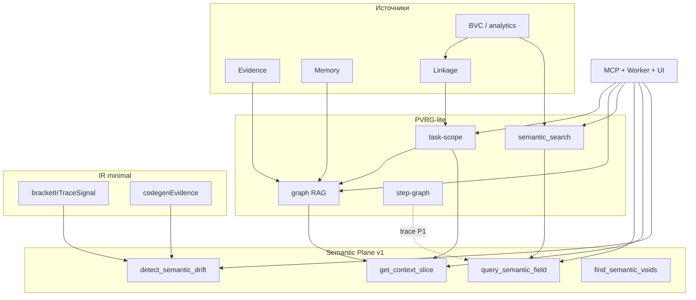

# AN-69: PVRG и IR в Work Graph — фактическое использование и применимость к смысловой плоскости

**Запрос:** изучить, как сейчас используются PVRG и IR, используются ли вообще, и можно ли их применить для смысловой плоскости (AN-68).

**Дата:** 2026-06-04  
**Статус:** published  
**Ключ журнала:** AN-69

**Связи:** [AN-10](pvrg-verified-reference-graph.md) (PVRG как технология), [AN-9](ir-rich-ir-open-canon.md) (IR/RichIR open canon), [AN-38](llm-pvrg-richir-memory-slices-usage-audit.md) (аудит срезов для LLM), [AN-65](work-graph-intent-information-plane.md) (информационная плоскость), [AN-68](work-graph-semantic-plane.md) (смысловая плоскость), [ADR AN-9 deferred](../docs/adr-an9-rich-ir-deferred.md), эпик `epic-intent-information-semantic-planes-v1`.

---

## Короткий ответ

| Слой | Используется в WG runtime? | Роль сегодня | Для смысловой плоскости |
|------|---------------------------|--------------|-------------------------|
| **PVRG (lite)** | **Да, активно** | Task-graph + Graph RAG + semantic search — derived из BVC/backlog, не AST-сканер | **Да — основа P0**: узлы, рёбра, срезы, MCP уже есть; нужны метрики drift и semantic field поверх |
| **IR / RichIR / TurIr** | **Почти нет** (draft spec + trace-сигналы) | Машинный CFG из ioHasC **не портирован**; в WG — bracket-IR hash и codegen evidence | **Частично — P1/P2**: trace смысла и temporal, не ядро drift в v1 |
| **Step-graph** | **Да** | Refs между `#Block<[...]>` в `.bvc` файлах | Вспомогательный слой «Trace of Meaning», не замена semantic field |

**Вывод:** смысловую плоскость v1 строить **на PVRG-lite + semantic_search + BVC-поля**, а не ждать полного IR runtime. IR подключать точечно там, где нужна **эволюция намерения во времени** (vectorHash, bracket drift), а не как универсальный движок alignment.

---

## 1. Что в WG называется «PVRG»

В Work Graph **PVRG ≠ полный `pvrg-core/` ioHasC** (multi-language AST, logical components, GFS overlay).

Здесь PVRG — **derived project graph** поверх intent tree:

| Артефакт | Schema | Источник данных |
|----------|--------|-----------------|
| Unified linkage | `unified-linkage.projection.v1` | `depends_on`, `target_files`, trace labels, analytics refs |
| Task scope | `pvrg.task-scope.slice.v1` | linkage + BFS по work/file |
| Graph RAG | `pvrg.graph_rag.slice.v1`, `pvrg.graph_rag.context.v1` | task scope + evidence + memory + adapter facts |
| Semantic search | `semantic-search.result.v1` | BM25 + TF-IDF по BVC-полям work items и путям файлов |
| Step graph | `step-graph.projection.v1`, `step-graph.slice.v1` | regex-парсинг `#Name<[...]>` refs в repo |

Публичная спека: `packages/pvrg-spec/` (draft, AN-42). Full scanner — вне репо WG.

---

## 2. Где PVRG реально используется (код и потребители)

### 2.1. Runtime-модули

| Модуль | Назначение |
|--------|------------|
| `src/pvrgTaskScope.mjs` | Bounded subgraph: work ↔ file ↔ depends_on |
| `src/graphRagContextSlice.mjs` | Обогащённый срез: work, files, evidence, memory, provider runs |
| `src/unifiedLinkageProjection.mjs` | Единая проекция связей (основа task scope) |
| `src/semanticSearchWorkflow.mjs` | Lexical/hybrid поиск; веса на `basis`, `vector`, `goal`, `title` |
| `src/stepGraphSlice.mjs` | Граф ссылок между BVC-блоками (не PVRG nodes, но «semantic map») |

### 2.2. MCP (`packages/workgraph-mcp`)

| Tool / Resource | Статус |
|-----------------|--------|
| `get_pvrg_task_scope` | ✅ production |
| `get_graph_rag_context` | ✅ production (AN-38 устарел: tool уже есть) |
| `get_unified_linkage` | ✅ production |
| `semantic_search` | ✅ production |
| `get_step_graph_projection` / `get_step_graph_slice` | ✅ production |
| `workgraph://pvrg/scope/{workId}` | ✅ resource |
| `workgraph://pvrg/graph-rag/{workId}` | ✅ resource |

### 2.3. WG agent worker

| Потребитель | Авто-инъекция? |
|-------------|----------------|
| `agentWorkerOpenAiProvider.mjs` | ✅ Graph RAG context в system prompt |
| `agentWorkerLocalRunner.mjs` | ✅ memory slice (если есть записи) |
| `workGraphLlmUsefulnessEval.mjs` | ✅ eval harness для PVRG + graph RAG |

Cursor **не получает auto-inject** — модель должна вызвать MCP tool сама (или следовать cursor rule proactive PVRG).

### 2.4. UI dashboard

| Поверхность | Что показывает |
|-------------|----------------|
| Task drawer → accordion «PVRG область» | `/api/pvrg-task-scope` — nodes/edges локального subgraph |
| Unified linkage panel | trace + planning edges |
| Semantic search в sidebar | фильтрует backlog по `semantic_search` hits |

### 2.5. Бэклог PVRG (intent/research/pvrg)

Все ключевые задачи **закрыты (done)**:

- `implement-mcp-get-pvrg-task-scope`
- `implement-pvrg-graph-rag-context-slice`
- `implement-full-semantic-search-workflow`
- `port-unified-linkage-serialization`
- `wire-pvrg-task-scope-dashboard-panel`
- `phase-4-trace-pvrg-semantic-map`
- `publish-pvrg-public-spec-an42`

**PVRG в WG — не эксперимент, а рабочий слой контекста.**

### 2.6. Чего PVRG в WG **не делает**

- Нет file-level call graph / AST nodes (function, class, import)
- Нет live repo scan на каждый запрос — только derived из BVC labels и snapshot
- Нет cross-repo federation
- Semantic search — **lexical BM25/TF-IDF**, не embedding ANN (концепт AN-68 — расширение, не замена)

---

## 3. Что в WG называется «IR»

### 3.1. Три разных «IR» (источник путаницы)

| Имя | Где | Статус в WG |
|-----|-----|-------------|
| **RichIR / TurIr / IR Flow CFG** | ioHasC `src/ir/` (вне WG) | **Deferred** — [ADR AN-9](../docs/adr-an9-rich-ir-deferred.md) |
| **IR Flow draft spec** | `packages/ir-spec/` | **Published draft** (AN-42), без executor в WG |
| **Bracket IR trace** | `src/bracketIrTraceSignal.mjs` | **Minimal port** — SHA256 vectorHash секции `Вектор: bracket:...` |
| **Codegen / verify IR** | `src/codegenEvidence.mjs`, `verificationLoop.mjs` | **Used** — gates для codegen round-trip |
| **WorkItem как IR** | каждый `.work.bvc` atom | **Primary** — человекочитаемый IR backlog |

### 3.2. Что реально исполняется

| Компонент | Использование |
|-----------|---------------|
| `bracketIrTraceSignal.mjs` | Drift bracket-секции vs stored hash; evidence в verify |
| `codegenEvidence.mjs` | Structured evidence для codegen/round-trip CLI |
| `stepGraphSlice.mjs` | Навигация по refs между step-блоками (не CFG decision/action) |
| `lowcodeScaffoldCli.mjs` | Stub; TurIr/Handlebars **explicitly deferred** |

### 3.3. Бэклог IR

| Задача | Статус | Смысл |
|--------|--------|-------|
| `phase-5-ir-codegen-runtime` | **done** | Порт verify/codegen pipeline, не TurIr executor |
| `publish-ir-richir-public-spec-an42` | **done** | Draft `packages/ir-spec/` |
| `decide-an9-rich-ir-runtime-or-deferred` | **done** | RichIR runtime отложен |
| `sync-an14-ir-open-canon-multilingual` | **done** | Документация open canon |
| `port-bracket-ir-trace-envelope` | backlog | Расширение trace envelope |

**RichIR/TurIr identifiers в `src/` — ноль.** LLM не видит CFG IR; видит BVC-текст и JSON projections.

---

## 4. Сравнение с AN-38 (что изменилось)

[AN-38](llm-pvrg-richir-memory-slices-usage-audit.md) (2026-06-01) актуален по архитектуре worker vs Cursor, но **устарел по MCP surface**:

| Утверждение AN-38 | Сейчас (2026-06-04) |
|-------------------|---------------------|
| Graph RAG только worker | ✅ MCP `get_graph_rag_context` + resource |
| Memory records не в MCP | ✅ `list_memory_records`, `get_memory_record` |
| Evidence records не в MCP | ✅ `list_evidence_records`, `get_evidence_record` |

Остальное AN-38 верно: **RichIR не в runtime**, PVRG = task-graph not AST graph.

---

## 5. Можно ли использовать для смысловой плоскости (AN-68)?

### 5.1. Карта инструментов AN-68 → существующий задел

| Semantic Plane (AN-68) | Уже есть | Чего не хватает |
|------------------------|----------|-----------------|
| `query_semantic_field` | `semantic_search` (BM25+TF-IDF по BVC) + graph RAG nodes | Ранжирование по полям Basis/Vector/Goal отдельно; scope=domain/epic; связь с analytics nodes |
| `detect_semantic_drift` | `bracketIrTraceSignal` (drift bracket hash), evidence failed checks | Goal vs git diff vs tests; drift_score 0..1 по work item |
| `get_context_slice` | `get_graph_rag_context` + `get_pvrg_task_scope` | Единый контракт с лимитом байт, deny_patterns, role-aware excerpt BVC |
| `find_semantic_voids` | linkage + target_files gaps частично | Files без work, AN без epic, work без evidence — batch scan |
| Trace of Meaning | step-graph + analytics lineage + intent hierarchy | Temporal chain AN→epic→work без IR CFG |
| Semantic Scope UI | PVRG panel + semantic search filter | Heatmap drift на графе |

### 5.2. Роль PVRG — **основной несущий слой**

PVRG-lite уже даёт:

1. **Typed nodes** — work, file, evidence, memory (graph RAG)
2. **Verified-ish edges** — depends_on, targets, has_evidence (confidence labels)
3. **Agent subgraph extraction** — bounded BFS (`maxNodes`, `maxDepth`)
4. **MCP + worker parity** — один контракт для Cursor и WG worker

Для смысловой плоскости **не нужно** портировать `pvrg-core/` AST scanner в v1. Нужно:

- Добавить **semantic metrics** поверх существующих nodes (`design-semantic-plane-metrics-v1`)
- Расширить `semantic_search` → `query_semantic_field` (те же documents, новый API и ranking profile)
- Собрать `get_context_slice` из graph RAG + BVC excerpt (задача уже в эпике)

### 5.3. Роль IR — **вспомогательная, не блокирующая P0**

| Сценарий AN-68 | IR полезен? | Как |
|----------------|-------------|-----|
| Alignment BVC.Goal vs код | ⚠️ Слабо в v1 | TF-IDF/BM25 + diff heuristics достаточно; embedding — позже |
| Trace of Meaning (эволюция решения) | ✅ Средне | Step-graph + analytics lineage; RichIR CFG — overkill для v1 |
| Bracket / vector drift | ✅ Да | Уже `bracketIrTraceSignal` — включить в `detect_semantic_drift` как один сигнал |
| Temporal snapshots | ⚠️ P2 | IR Flow history потребует port TurIr или journal snapshots BVC revisions |
| Resolve semantic conflict | ❌ P2 | Нужен compare Basis/Vector двух work items — BVC text, не CFG |

**Рекомендация:** не разблокировать RichIR runtime ради semantic plane. Revisit IR когда появится pilot на **исполнимый workflow** (не backlog navigation).

---

## 6. Архитектурная схема (как слои стыкуются)

---

## 7. Риски и anti-patterns

| Риск | Mitigation |
|------|------------|
| Ждать port TurIr перед semantic plane | Строить drift на BVC + evidence + bracket hash |
| Дублировать PVRG вторым «semantic graph» | Расширять schemas `pvrg.*`, не вводить параллельный graph store |
| Путать information plane (AN-65) и semantic plane (AN-68) | AN-65 = topology/query_intent_plane; AN-68 = metrics поверх тех же nodes |
| Переоценить lexical search как «семантику» | v1 честно label `lexical-v1`; embedding profile — отдельная фаза |
| Тянуть pvrg-core AST в WG monolith | Оставить lite; AST — optional adapter fact source позже |

---

## 8. Решения и next steps

1. **PVRG используется и нужен** — semantic plane v1 = evolution of PVRG-lite, не greenfield.
2. **IR (RichIR) в runtime не используется** — не блокирует эпик; bracket IR — один input для drift.
3. **Эпик `epic-intent-information-semantic-planes-v1` корректен**: зависимости `implement-full-semantic-search-workflow` + linkage уже done.
4. **Уточнить подзадачи** (optional backlog tweak):
   - `implement-detect-semantic-drift-mcp-v1` — явно reuse `bracketIrTraceSignal` + semantic_search scores
   - `implement-query-semantic-field-mcp-v1` — alias/wrapper над `semanticSearchWorkflow`, не новый indexer
5. **Обновить AN-38** footnote или closing note — MCP surface 2026-06-04.

---

## 9. Evidence (файлы для верификации)

- `src/pvrgTaskScope.mjs`, `src/graphRagContextSlice.mjs`, `src/semanticSearchWorkflow.mjs`
- `packages/workgraph-mcp/src/index.mjs` — tools list
- `docs/adr-an9-rich-ir-deferred.md`
- `packages/pvrg-spec/`, `packages/ir-spec/`
- `intent/research/pvrg/work/*.work.bvc` — статусы done
- `docs/plan-intent-information-semantic-planes-v1.md`
