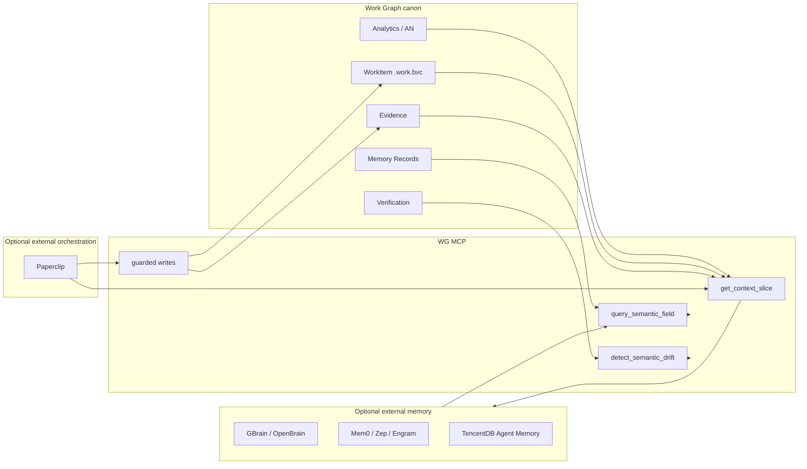

# AN-76: Общая память и управление AI-агентами — GBrain, OpenBrain, Engram, Mem0, Zep, Letta, LangMem, TencentDB, Paperclip vs Work Graph

**Запрос:** изучить статью [«Почему Claude Code и Codex не ускоряют команду: у компании нет общей памяти»](https://habr.com/ru/articles/1043734/), сравнить упомянутые решения (`GBrain`, `OpenBrain`, `Engram`, `Mem0`, `Zep`, `Letta`, `LangMem`, `TencentDB Agent Memory`) с Work Graph: являются ли конкурентами, что WG может дать взамен, где нужна интеграция. Дополнение: добавить Paperclip (`paperclipai/paperclip`) как смежный проект управления AI-агентами.

**Дата:** 2026-06-05  
**Статус:** разбор  
**Связи:** [AN-44](competitor-analysis-vs-work-graph.md), [AN-65](work-graph-intent-information-plane.md), [AN-68](work-graph-semantic-plane.md), [AN-69](pvrg-ir-semantic-plane-usage-audit.md), [AN-38](llm-pvrg-richir-memory-slices-usage-audit.md)

---

## 1. Короткий вывод

Статья правильно фиксирует рынок: **следующая ценность AI-native разработки — не модель и не IDE, а общий слой контекста**, которым владеет компания. Локальные `CLAUDE.md`, `AGENTS.md`, заметки и чаты дают разный уровень “ума” разным сотрудникам; без общей памяти компания не накапливает уроки.

Для Work Graph это важный сигнал, но не прямое совпадение с рынком memory-продуктов.

**WG не должен становиться клоном GBrain/Mem0/Zep.** Его сильная позиция — не “память обо всём”, а **контрактная память работы**:

`AN → decision → epic → .work.bvc → claim → evidence → verification → memory record → closing`

То есть WG отвечает не только на “что мы знаем?”, а на:

- что мы решили сделать;
- почему выбрали этот путь;
- какая задача из этого родилась;
- кто/какой агент её взял;
- чем доказано выполнение;
- где реализация разошлась с намерением.

**Прямой конкурентный риск:** GBrain/OpenBrain/Engram/Zep могут забрать язык “общей памяти компании” и стать первым MCP-сервером, который подключают к Cursor/Claude Code. Paperclip может забрать соседний язык “управления агентами на работе”: org chart, цели, бюджеты, governance, heartbeat, tasks. Тогда WG будет выглядеть как “ещё один локальный трекер задач”.

**Ответ WG:** позиционировать себя как **Work Memory / Intent & Evidence Graph**, а не generic knowledge base. Интегрироваться с memory-продуктами как с retrieval/storage слоем, но сохранять `work.id`, BVC, evidence, gates и lineage как собственный канон.

---

## 2. Что утверждает статья

Тезисы статьи:

1. Claude Code, Codex, Cursor и другие агенты не дают ожидаемого ускорения команде, если у компании нет общей памяти.
2. Модель и рабочий инструмент заменяемы; **контекст компании** — актив, который должен принадлежать компании.
3. Markdown-репозиторий — хороший старт, но при росте файлов нужен слой поиска, связей, синтеза и прав доступа.
4. Нормальная память должна:
   - искать по смыслу, не только по ключевым словам;
   - возвращать короткий ответ со ссылками;
   - понимать связи между людьми, проектами, решениями и задачами;
   - разделять доступы;
   - находить устаревшие и противоречивые факты;
   - позволять нескольким агентам пользоваться одной памятью.
5. GBrain подаётся как пример self-hosted продукта: markdown source of truth, MCP, OAuth/sources, graph search, synthesis/gap finding.

Это почти тот же вектор, что у AN-65/AN-68: **информационная и смысловая плоскость**. Отличие: статья говорит про общую память компании вообще, а WG уже строит более узкий слой — память намерений, задач, доказательств и проверок.

---

## 3. Карта рынка: кто реально конкурент

| Решение | Что это | Конкурент WG? | Вердикт |
|---|---|---:|---|
| **GBrain** | Markdown-first shared brain + Postgres graph + MCP + OAuth/sources | Да, частично | Конкурент за категорию “общая память агентов”; комплемент как внешний brain backend |
| **OpenBrain** | Typed/versioned memory objects, structured + semantic search, MCP/HTTP | Да, частично | Ближе к WG по typed records; может конкурировать с WG memory plane |
| **Engram** | MCP-native persistent memory; локально SQLite/LanceDB или cloud; consolidation/conflicts | Да, частично | Конкурент для “память команды/агента”; слабее WG по work/evidence contracts |
| **Mem0** | Universal memory layer for agents/apps; OSS + managed; graph memory, rerank, APIs | Да, но на другом слое | Конкурент как production memory API; хороший интеграционный кандидат |
| **Zep** | Enterprise agent memory на temporal knowledge graph / Context Graphs | Да, стратегически | Самый сильный enterprise-конкурент по temporal graph и governance |
| **Letta** | Stateful agent runtime with core/archival memory | Скорее нет | Это runtime для агентов; интеграция возможна, но он не заменяет WG |
| **LangMem** | Библиотека памяти для LangChain/LangGraph | Нет, в основном | Примитивы для агентов; полезно как implementation layer, не продукт-конкурент WG |
| **TencentDB Agent Memory** | Local-first symbolic short-term + layered long-term memory, Mermaid task canvas, node_id trace | Да, в коротком контексте | Очень близко к WG по traceability/offloading; интеграционно интересно |
| **Paperclip** | Self-hosted app для управления командами AI-агентов: org chart, goals, budgets, governance, heartbeat execution, tasks | Да, но на orchestration/work-management слое | Не memory-конкурент, а соседний/опасный конкурент за “операционную панель AI-workforce” |

---

## 4. Сравнение по продуктам

### 4.1. GBrain

**Что делает:** хранит знания как markdown repo, индексирует в Postgres, строит typed knowledge graph, даёт MCP tools для чтения/записи/поиска, remote HTTP/OAuth, sources/brains, синтез и gap finding. Сильная идея: **git/markdown остаётся source of truth**, база — retrieval/projection layer.

**Где конкурент WG:**

- претендует на “централизованный контекст компании”;
- подключается к тем же агентам через MCP;
- умеет читать/писать markdown и отвечать со ссылками;
- может стать первым слоем, который команда поставит вместо WG.

**Где не заменяет WG:**

- не моделирует lifecycle работы: `claim`, статус, ready/done gates;
- нет BVC-контракта `basis/vector/goal`;
- нет обязательной связки “задача → evidence → verification”;
- не является backlog/board/workflow OS.

**Что WG может дать взамен:** не “больше памяти”, а **память обязательств**: почему задача существует, какой outcome обещан, какие evidence доказывают готовность.

**Интеграция:** нужна как P1/P2. GBrain можно использовать как внешний `brain` для long-term org knowledge, а WG экспортирует туда `AN`, decisions, closing analyses и memory records. Обратно WG может читать GBrain для context slice, но запись статусов и evidence должна оставаться в WG.

### 4.2. OpenBrain

**Что делает:** typed, versioned memory objects (`claims`, `decisions`, `tasks`, `artifacts`, `entities`, `relations`, `thought summaries`), structured search + semantic search, MCP and HTTP API.

**Где конкурент WG:**

- typed memory objects пересекаются с `AN`, WorkItem, evidence, decisions;
- “machine-readable memory layer” звучит близко к `intent graph`;
- может стать универсальным substrate для того, что WG хранит в BVC/JSONL.

**Где не заменяет WG:**

- generic memory plane не задаёт конкретный work protocol;
- нет WG-specific gates: `done requires evidence`, `blocked requires reason`, `claim before execution`;
- не даёт операторский UX бэклога, доски, verification и OneBase-вертикали.

**Что WG может дать взамен:** более жёсткую доменную схему: WorkItem — не просто memory object, а исполняемый контракт с проверками.

**Интеграция:** возможна как backend adapter: `memory-record-v1`, `analytics-record`, `decision`, `evidence` могут mirror-иться в OpenBrain typed objects. Это особенно полезно, если WG не хочет сам развивать vector/embedding/rerank инфраструктуру.

### 4.3. Engram

**Что делает:** persistent memory для MCP-агентов. Есть разные реализации/позиционирование: local SQLite/FTS/LanceDB, tools для remember/recall/consolidate/conflicts, cloud sync/dashboard, иногда акцент на full transcript storage and replay.

**Где конкурент WG:**

- закрывает боль “один агент узнал — другие агенты знают”;
- MCP-native, быстро ставится, проще объясняется пользователю;
- contradiction detection/consolidation пересекаются с будущими `resolve_semantic_conflict` и `find_semantic_voids`.

**Где не заменяет WG:**

- память не равна канону работы;
- transcript replay не доказывает, что задача сделана правильно;
- без BVC/evidence модель легко превращается в “всё помним, но не знаем, что является обязательством”.

**Что WG может дать взамен:** структурный фильтр: что из raw transcript стало решением, задачей, evidence или уроком. WG может быть “curation layer” над Engram.

**Интеграция:** полезна для session memory/offloading. WG не должен хранить все чаты; он должен уметь импортировать из Engram только distilled records: decisions, blockers, failures, accepted lessons.

### 4.4. Mem0

**Что делает:** production memory layer for agents/apps: OSS library/server + managed platform, API/SDK, graph memory, metadata filtering, reranking, multimodal, dashboard, audit/API keys в self-hosted/server вариантах.

**Где конкурент WG:**

- mature memory API и managed platform быстрее, чем WG сможет построить;
- enterprise/user memory use cases закрывает лучше;
- интеграции с agent frameworks делают его default memory choice.

**Где не заменяет WG:**

- фокус на personalized/contextual agents, а не work lifecycle;
- “memory add/search/update” не равно “task contract verified by evidence”;
- нет локального BVC-source-of-truth и связки с intent tree.

**Что WG может дать взамен:** память не пользователя, а **память продукта и работы**: решения, договорённости, проверки, accepted evidence.

**Интеграция:** да. Mem0 стоит рассматривать как внешний memory provider для worker/context slice, особенно если нужен быстрый managed вариант. Но WG должен отправлять туда только нормализованные записи с `work.id`, `evidence.id`, `analytics.key`, а не отдавать Mem0 роль первичного backlog/source-of-truth.

### 4.5. Zep

**Что делает:** enterprise memory at scale на temporal knowledge graph: episodes, entity nodes, edges/facts, validity intervals, user/group graphs, low-latency context string, governance/audit/retention. Сильная фича: факты меняются во времени, старые invalidated, provenance сохраняется.

**Где конкурент WG:**

- temporal graph — прямое пересечение с AN-65/AN-68 temporal plane;
- governance/audit/retention забирают enterprise narrative;
- group graphs могут хранить organizational knowledge better-than-WG, если WG останется только файлами.

**Где не заменяет WG:**

- Zep хранит evolving facts, но не задаёт процесс “как работа становится done”;
- не является локальным git/BVC workflow;
- не содержит доменной модели backlog/evidence/verification.

**Что WG может дать взамен:** **детерминированный work ledger**, где temporal graph не выводится из диалогов, а строится из явных атомов, статусов и evidence.

**Интеграция:** стратегически нужна, но аккуратно. Zep может быть external Context Lake для больших организаций; WG — источником curated episodes/facts: decisions, status transitions, evidence summaries, semantic drift signals. Не отдавать Zep право определять task status.

### 4.6. Letta

**Что делает:** stateful agent platform: persistent agents, core memory blocks always in context, archival memory, conversation search, tools for agent-managed memory edits, sleeptime/background memory processing.

**Где конкурент WG:**

- если пользователь хочет “агента, который помнит и сам учится”, Letta звучит ближе, чем WG;
- Letta Code и context repositories могут пересечься с coding-agent workflow.

**Где не заменяет WG:**

- Letta — runtime/agent framework, а WG — work/evidence backend;
- memory blocks — self-editing text; это не audit-safe work contract;
- agent identity/persona не заменяет backlog, board, verification matrix.

**Что WG может дать взамен:** независимую от agent runtime память проекта. Letta-agent может умереть/смениться, а WG ledger остаётся.

**Интеграция:** Letta может быть worker provider или external agent runtime, который читает WG через MCP и пишет evidence назад. Не нужно встраивать Letta memory model в WG core.

### 4.7. LangMem

**Что делает:** SDK/primitives для LangChain/LangGraph: manage/search memory tools, background managers, semantic/procedural/episodic memory, prompt optimization, storage-agnostic core.

**Где конкурент WG:** почти нигде как продукт. Это library layer.

**Где полезен WG:**

- если WG worker/daemon когда-то будет на LangGraph, LangMem может дать готовые hot-path/background memory primitives;
- procedural memory можно использовать для эволюции agent rules, но после human/contract approval.

**Интеграция:** опционально как implementation detail. Не нужно позиционировать WG против LangMem; правильнее сказать: WG может использовать такие библиотеки под капотом, но канон остаётся BVC/evidence.

### 4.8. TencentDB Agent Memory

**Что делает:** local-first memory с двумя интересными слоями:

- symbolic short-term memory: raw tool logs offloaded to `refs/*.md`, step summaries in jsonl, top-level Mermaid task canvas in context;
- layered long-term memory: L0 conversation → L1 atom → L2 scenario → L3 persona;
- `node_id` tracing from compressed graph back to raw evidence;
- local SQLite/sqlite-vec and optional Tencent Cloud Vector DB.

**Где конкурент WG:**

- очень близко к идее “нижние слои хранят evidence, верхние — структуру”;
- Mermaid task canvas похож на compressed execution graph;
- `node_id` traceability конкурирует с WG trace/evidence narrative;
- local-first, OpenClaw/Hermes integrations — тот же агентский мир.

**Где не заменяет WG:**

- task canvas — runtime memory, а не backlog governance;
- L0-L3 memory pipeline не задаёт business/work contract;
- нет `AN → decision → work item → evidence → verification` как продуктового цикла.

**Что WG может дать взамен:** более формальный и проверяемый слой над похожей идеей progressive disclosure. WG может сказать: “у нас не просто Mermaid-canvas состояния агента, а проверяемый граф намерений и доказательств”.

**Интеграция:** самый интересный источник идей для WG:

- context offload для agent worker logs;
- `node_id`/`result_ref` как pattern для evidence drill-down;
- lightweight symbolic canvas как prompt slice;
- L0→L3 distillation как модель для `memory-record-v1` evolution.

### 4.9. Paperclip

**Что делает:** Paperclip позиционируется как open-source self-hosted app для управления AI-агентами на работе: Node.js server + React UI, “bring your own agent”, org chart, business goals, budgets, governance, approvals, task system, heartbeat execution. Поддерживает модель, где агентам назначают роли и цели, они просыпаются по heartbeat, берут задачи, делегируют подзадачи, сообщают blockers/progress. Быстрый старт — `npx paperclipai onboard --yes`; локально использует embedded Postgres/PGlite, UI по умолчанию на `localhost:3100`.

**Это не memory-layer.** Paperclip не конкурирует с GBrain/Mem0/Zep за retrieval-память. Он конкурирует с WG в другом месте: **операционная панель для агентской работы**.

**Где конкурент WG:**

- Paperclip продаёт более понятный executive narrative: “manage AI agents at work”, “org chart”, “goals”, “budgets”, “governance”;
- у него есть tasks, parent links, checkout/heartbeat execution и accountability — это пересекается с WG board/backlog/claim;
- self-hosted/open-source и BYO agents бьют в ту же аудиторию, которая не хочет зависеть от одного IDE-вендора;
- Paperclip может стать “главной панелью” для автономных агентов, а WG — только локальным evidence sidecar.

**Где не заменяет WG:**

- Paperclip управляет агентами и бизнес-целями, но публичное позиционирование не показывает BVC-like contract `basis/vector/goal`;
- task completion и accountability не равны формальной связке `work.id → evidence → verification gate`;
- org chart/budget/governance не отвечают на вопрос “насколько реализация совпала с исходным намерением?”;
- нет явного канона `AN → decision → work item → evidence → closing` как долговременного ledger продукта.

**Что WG может дать взамен:** не “нанять CEO-агента”, а **доказуемое исполнение работы**. Paperclip отвечает “кто из агентов чем занят и сколько стоит”; WG отвечает “почему эта работа существует, какой контракт был принят, чем доказано выполнение и можно ли закрывать”.

**Интеграция:** Paperclip может быть внешним orchestrator/agent manager, а WG — source of truth для work contracts and evidence.

Практичная схема:

- Paperclip создаёт/назначает operational tasks and agent heartbeats;
- WG хранит canonical `.work.bvc`, parent/depends_on, evidence, verification, semantic drift;
- Paperclip agent при checkout вызывает WG MCP: `get_context_slice`, `get_work_contract`, `add_work_item_evidence`, `assert_task_ready_for_done`;
- closing/lessons из WG могут возвращаться в Paperclip как progress/accountability summaries.

**Риск интеграции:** двойной бэклог. Если Paperclip tasks и WG WorkItems оба становятся primary, появится расхождение статусов. Нужен выбор:

- либо WG primary для engineering work, Paperclip только orchestrates agents;
- либо Paperclip primary для business/company goals, WG primary для implementation/evidence subgraph.

Для текущей стратегии WG правильнее второе: **Paperclip над агентами, WG под задачами как evidence ledger**.

---

## 5. Где WG сильнее всех этих решений

### 5.1. Intent and obligation, not just memory

Memory-продукты умеют помнить факты. WG должен владеть другим объектом: **обязательством**.

| Вопрос | Memory-продукт | WG |
|---|---|---|
| Что мы знаем? | Да | Да, частично |
| Почему решили делать X? | Частично | Да: `AN/decision/basis` |
| Какая задача из этого родилась? | Частично | Да: `.work.bvc` |
| Кто/что взял задачу? | Обычно нет | Да: `claim` |
| Чем доказано выполнение? | Обычно нет | Да: `evidence` |
| Можно ли закрыть задачу? | Нет | Да: gates/verification |
| Где код ушёл от намерения? | Обычно нет | Цель AN-68 |

Paperclip добавляет ещё один вопрос:

| Вопрос | Paperclip | WG |
|---|---|---|
| Какую роль занимает агент? | Да: org chart/agents | Частично: ownerRole |
| Как агент просыпается и берёт работу? | Да: heartbeat/checkouts | Частично: worker/claim |
| Сколько стоит агентская работа? | Да: budgets/spend | Нет/будущее |
| Чем доказано выполнение engineering-задачи? | Не ядро | Да: evidence/verification |
| Где формальный контракт задачи? | Не ядро | Да: BVC |

### 5.2. Contracted memory

Обычная память “помнит”. WG-память должна быть **контрактной**:

- `Basis` — почему задача существует;
- `Vector` — что меняем;
- `Goal` — как поймём, что цель достигнута;
- `Evidence` — чем подтверждено;
- `Status transition` — кто и когда перевёл состояние;
- `Closing` — чему научились.

Это сложнее продать как “brain”, но сильнее для командной разработки: агенту нельзя просто “вспомнить”, он должен выполнить и доказать.

### 5.3. Git/local source of truth

GBrain тоже силён в git/markdown. Но WG уже имеет:

- BVC atoms;
- intent tree;
- analytics journal;
- work items;
- verification records;
- MCP resources/tools;
- dashboard projections.

Задача не в том, чтобы заменить это vector DB, а в том, чтобы построить поверх этого retrieval и semantic plane.

---

## 6. Где WG слабее и что надо закрывать

### 6.1. Retrieval quality

GBrain/Zep/Mem0/Engram продают качество recall: hybrid/vector search, rerank, graph traversal, context string. WG сейчас имеет `semantic_search`, Graph RAG slices и memory records, но это больше deterministic/project-scoped retrieval, чем зрелая memory platform.

**Решение:** не строить сразу полный Zep/GBrain. P0 — улучшить `get_context_slice` / `query_semantic_field` для WorkItems, AN, evidence и memory records. P1 — adapter к внешнему memory backend.

### 6.2. Auto-consolidation

Memory-продукты умеют/обещают consolidation, contradiction detection, gap finding. WG пока больше про явные записи и ручной анализ.

**Решение:** WG consolidation должен быть approval-based:

1. агент предлагает memory/decision update;
2. WG показывает diff к BVC/AN/memory record;
3. оператор принимает;
4. только после этого запись становится canonical.

### 6.3. Access control and multi-tenant

Статья подчёркивает права доступа. WG local/git хорош для одного проекта, но слабее как multi-team org brain.

**Решение:** не делать enterprise ACL в core v1. Для команды — repo-level permissions. Для org memory — интеграция с GBrain/Zep/Mem0/OpenBrain, где ACL уже продуктовая функция.

### 6.4. Marketing category

“Общая память компании” звучит проще, чем “BVC intent/evidence graph”. WG рискует быть непонятным.

**Решение:** использовать понятную формулу:

> Work Graph — это общая память команды о работе: решения, задачи, доказательства и проверки, доступные любому агенту через MCP.

А затем уточнять: это не generic memory, а **work memory with evidence**.

### 6.5. Agent management UX

Paperclip показывает слабое место WG с другой стороны: людям проще купить “панель управления агентами” с org chart, roles, budgets, approvals and heartbeat, чем “граф намерений и доказательств”.

**Решение:** не пытаться быстро копировать Paperclip как company simulator. Для WG достаточно усилить свою границу:

1. ясный “agent work control” поверх существующих claim/status/evidence;
2. видимость активных агентов/claims/blockers;
3. бюджет/стоимость как optional evidence/metadata позже;
4. интеграционный режим “Paperclip orchestrator → WG evidence ledger”.

---

## 7. Рекомендуемая архитектура: WG + memory backends

Правило границы:

- **WG canon:** статусы, work ids, BVC, evidence, verification, decisions.
- **External memory:** retrieval, embeddings, cross-agent recall, transcript/session offload, long-term org context.
- **External orchestration:** org chart, agent heartbeat, budgets, approvals and high-level business goals.
- **Запись в canon:** только через WG guarded tools.

---

## 8. Практические решения для roadmap

| ID | Решение | Приоритет |
|---|---|---|
| D1 | Позиционировать WG как **shared work memory with evidence**, а не generic memory | P0 |
| D2 | Довести MCP semantic navigator: `get_context_slice`, `query_semantic_field`, `detect_semantic_drift`, `find_semantic_voids` | P0/P1 |
| D3 | Сделать `memory-record-v1` first-class: связи с `AN`, `work.id`, `evidence`, `decision`, closing | P0 |
| D4 | Добавить export/mirror adapter: WG → GBrain/OpenBrain/Mem0/Zep format | P1 |
| D5 | Добавить import proposal flow: external memory → proposed AN/decision/memory record, с approval | P1 |
| D6 | Заимствовать у TencentDB Agent Memory context offload: raw logs in refs, compact symbolic task map in prompt | P1 |
| D7 | Не строить свой enterprise ACL/vector platform в core v1; для этого использовать backend adapters | P2 |
| D8 | Для Paperclip зафиксировать boundary: external orchestrator может назначать агентов, но `done/evidence` закрываются только через WG gates | P1 |
| D9 | Добавить “agent activity / active claims” projection в WG UI, чтобы не проигрывать Paperclip narrative полностью | P1 |

---

## 9. Что говорить пользователю/рынку

Неправильно:

> WG — это ещё одна память для агентов.

Правильно:

> WG — это память команды о работе: решения, задачи, доказательства и проверки. GBrain/Mem0/Zep помогают агенту вспомнить факты; WG показывает, что было обещано, сделано и доказано.

Короткая формула:

> Memory tools remember context. Work Graph remembers commitments.

Для русскоязычного сайта:

> Инструменты памяти помогают агенту вспомнить контекст. Work Graph хранит обязательства: почему задача появилась, что должно измениться, чем это доказано и можно ли закрывать работу.

Относительно Paperclip:

> Paperclip manages the agent workforce. Work Graph verifies the work.

По-русски:

> Paperclip управляет агентской командой. Work Graph проверяет работу: намерение, контракт, доказательства и готовность к закрытию.

---

## 10. Итог

Решения из статьи являются конкурентами WG **только если WG пытается продаваться как “общая память”**. В этой категории GBrain/Zep/Mem0/Engram будут сильнее по retrieval, UX подключения и enterprise memory narrative. Paperclip добавляет другой риск: если WG пытается продаваться как “панель управления агентами”, Paperclip будет понятнее за счёт org chart/goals/budgets/heartbeat.

Но если WG удерживает свою границу — **intent/evidence/workflow graph** — они становятся в основном комплементами. Лучший путь:

1. WG остаётся canonical source of truth для работы.
2. Memory-продукты используются как retrieval/storage substrate.
3. Orchestration-продукты вроде Paperclip могут назначать агентов и будить их, но не должны владеть `done` без WG evidence gates.
4. Все external facts попадают в WG только через proposal + approval.
5. Дифференциатор WG формулируется как “общая память обязательств и доказательств”, а не “ещё один brain” или “ещё один agent org chart”.

**Вердикт:** интеграция нужна, но после укрепления собственного semantic/work memory канона. Сначала — `get_context_slice`, first-class `memory-record-v1` и active-claims/evidence UX; затем — adapters к GBrain/OpenBrain/Mem0/Zep, context offload по образцу TencentDB Agent Memory и Paperclip boundary adapter для агентской оркестрации.
