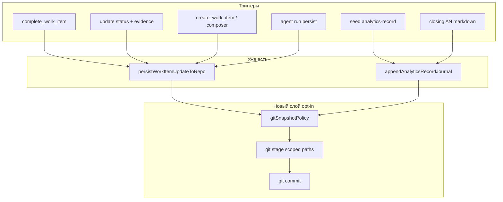

# AN-71: Автокоммиты Git при завершении задач, аналитике и др.

**Запрос:** можно ли встроить автоматические коммиты при завершении каждой задачи, создании анализа и т.д.? Проанализировать и сохранить в разборы.

**Дата:** 2026-06-04

---

## Краткий вывод

**Да, технически можно** — сейчас WG уже **пишет файлы в рабочую копию git** (`.work.bvc`, `work/analytics-records.jsonl`, `work/analytics/*.md`), но **не вызывает `git commit`**. Автокоммит — отдельный **opt-in слой** поверх существующих точек persist, с политикой «что коммитить» и без автоматического `push`.

**Рекомендация:** не вшивать «тихий commit» в `complete_work_item` по умолчанию; ввести **`workgraph.git.snapshot`** (CLI/MCP) + конфиг событий, scoped staging, debounce, SHA в evidence.

---

## Как сейчас (факты по коду)

| Событие | Что пишется на диск | Git |
|---------|---------------------|-----|
| `complete_work_item` / `update_work_item_status` | `persistWorkItemUpdatesToRepo` → patch `.bvc` в `intent/` | только файлы |
| `create_work_item`, Intent Composer apply | append/patch BVC + `intent/index.bvc` | только файлы |
| `seed:analytics-record` | строка в `work/analytics-records.jsonl` (+ md уже на диске) | только файлы |
| Agent Run `persistBacklog` | `persistWorkItemUpdateToRepo` | только файлы |
| Daemon tick | audit `work/daemon-audit.jsonl`, worker runs | только файлы |
| `scripts/push-git-bundle.mjs` | **единственный** явный `git commit` в репо | отдельный bundle export, не runtime WG |

Источник правды о задаче — **файлы BVC**, не коммит. Коммит — опциональная **внешняя** фиксация для людей и remote.

---

## Зачем автокоммиты

| Плюс | Минус |
|------|-------|
| История «задача закрыта → снимок репо» без ручного `git add` | Шум: сотни мелких коммитов |
| Evidence можно ссылать на `commit sha` | В dirty tree коммит захватит чужие правки |
| Аналитика (AN) сразу в git для команды | Конфликт с правилом «коммит только по запросу» у агента |
| CI/backup на push (если включён push) | Падение `git` блокирует `done` — плохой UX |
| Согласование с Spec Kit (spec на ветке) | Два продукта пишут в один repo — гонки |

---

## Точки встраивания (где ловить событие)



**Единая точка:** модуль `src/gitSnapshot.mjs` (имя условное), вызываемый **после успешного** `writeTextAtomically` / append journal, не до.

---

## Варианты дизайна

### A. Inline hook в persist (минимум API)

После `persistWorkItemUpdateToRepo` → если `policy.enabled` → stage paths из result + commit.

- **+** одна реализация для MCP и UI  
- **−** analytics и daemon нужны отдельные вызовы  

### B. MCP `git_snapshot_work_item` (явный шаг агента)

Агент после `complete_work_item` вызывает snapshot с `workId` и списком paths.

- **+** не ломает done при ошибке git; соответствует «коммит по намерению»  
- **−** агент может забыть  

### C. Debounced batch (daemon / timer)

Раз в N секунд или в конце tick коммитит все изменения под префиксами `intent/`, `work/`.

- **+** меньше коммитов  
- **−** размытая связь commit ↔ одна задача  

### D. Git worktree / branch per epic (тяжёлый)

Как Spec Kit (`001-feature`): epic → ветка, автокоммиты только в ней.

- **+** чистая история фичи  
- **−** сложность merge, не для всех операторов  

**Рекомендуемый MVP:** **A + B**: opt-in hook после persist **и** явный MCP tool; **без auto-push**.

---

## Политика коммита (черновик протокола)

Файл: `protocols/workgraph-git-snapshot-v1.bvc` или env `WORKGRAPH_GIT_SNAPSHOT=1`.

| Поле | Значение |
|------|----------|
| `enabled` | false по умолчанию |
| `events` | `work_item.done`, `work_item.status`, `analytics.created`, `analytics.closing` |
| `stage.paths` | только затронутые paths из persist result + опционально `work/analytics-records.jsonl` |
| `message.template` | `wg({event}): {workId|AN-key} — {title}` |
| `requireCleanSubset` | stage только known paths; не `git add -A` |
| `allowEmpty` | skip, не fail |
| `recordShaInEvidence` | при `complete_work_item` дописать `- commit: abc123` |
| `push` | **never** в v1 |
| `sign` | опционально, не в MVP |

Пример сообщения:

```text
wg(done): implement-intent-plane-linkage-index-v1 — linkage index v1
```

---

## Сопоставление с событиями WG

| Событие | Что stage | Commit message |
|---------|-----------|----------------|
| `complete_work_item` | изменённые `.bvc` + при policy `work/daemon-audit.jsonl` нет | `wg(done): {workId}` |
| `add_work_item_evidence` only | один `.bvc` | опционально, debounce 30s |
| `create_work_item` | новый `.bvc` + `intent/index.bvc` | `wg(intake): {workId}` |
| `seed:analytics-record` | `bodyPath` + `analytics-records.jsonl` | `wg(analytics): {AN-key}` |
| Closing epic script | closing md + jsonl + touched work items | `wg(closing): {epicId}` |
| Agent run persist | как status update | debounce с complete |

**Не коммитить автоматически:** `node_modules/`, `.env`, `dist/`, сгенерированные без policy, весь repo `git add -A`.

---

## Риски и ограничения

1. **Смешанный working tree** — оператор правит код в IDE + агент закрывает задачу → в commit попадёт лишнее. Решение: `git add -- path1 path2` только из `persisted.paths`.
2. **Частые MCP-вызовы** — debounce или commit только на `done` / `analytics.created`.
3. **Pre-commit hooks** — lint может **заблокировать** автокоммит; политика: `commit --no-verify` **запрещён** по умолчанию; при fail — append evidence «git snapshot failed», не откатывать `done`.
4. **Мультипроект** (`WORKGRAPH_ROOT` / AN-40) — snapshot относительно **корня проекта**, не monorepo WG tools.
5. **Агент Cursor** — user rule «не коммитить без запроса»; автокоммит WG = **настройка оператора репозитория**, не поведение агента по умолчанию.
6. **Spec Kit** — параллельно `.specify/` на ветке; WG-autocommit не должен коммитить `.specify/` без явного event.

---

## Сравнение с Spec Kit (AN-70)

| | Spec Kit | WG + autocommit |
|---|----------|-----------------|
| Единица версии | ветка + spec folder | `work.id` / `AN-XX` |
| Коммит | вручную через implement / разработчик | предлагаемый hook |
| Granularity | фича | задача / разбор |

Комбо: Spec Kit ведёт ветку фичи; WG после `complete_work_item` коммитит только `intent/.../task.work.bvc` в main (или в ту же ветку, если policy `branchTemplate`).

---

## MVP roadmap (если делать)

| Phase | Deliverable |
|-------|-------------|
| P0 | `src/gitSnapshot.mjs`: stage scoped paths, commit, return `{ sha, paths, skipped }` |
| P0 | Env `WORKGRAPH_GIT_SNAPSHOT=1` + `WORKGRAPH_GIT_SNAPSHOT_EVENTS=done,analytics` |
| P0 | Hook в `persistWorkItemUpdateToRepo` (post-write, try/catch, never throw to caller) |
| P1 | MCP `git_snapshot` + опция `recordShaInEvidence` в `complete_work_item` |
| P1 | Hook после `appendAnalyticsRecordJournal` |
| P2 | Debounce, `branchPerEpic`, optional `git push` с explicit flag |
| P2 | UI Settings: «Автокоммит при done» |

**Тесты:** temp git repo, complete task → 1 commit, только ожидаемые paths; dirty unrelated file не в commit.

---

## Рекомендация

| Вопрос | Ответ |
|--------|-------|
| Можно ли? | **Да** |
| Нужно ли по умолчанию? | **Нет** — opt-in |
| Где встраивать? | После `persistWorkItemUpdatesToRepo` и `appendAnalyticsRecordJournal` |
| Push? | **Нет** в v1 |
| Связь с evidence? | **Да** — optional commit SHA в «Свидетельства» |

Текущий разрыв («код в git?») — это **не баг WG**, а отсутствующая фича: WG обновляет файлы, git остаётся на операторе.

---

## Связанные документы

- [AN-70: Work Graph vs Spec Kit](work-graph-vs-spec-kit.md)
- [AN-44: конкуренты vs WG](competitor-analysis-vs-work-graph.md)
- [decision-pipeline-canon](../../docs/decision-pipeline-canon.md)
- `src/intentTreeWorkItems.mjs` — `persistWorkItemUpdateToRepo`
- `src/analyticsRecordStore.mjs` — journal append
